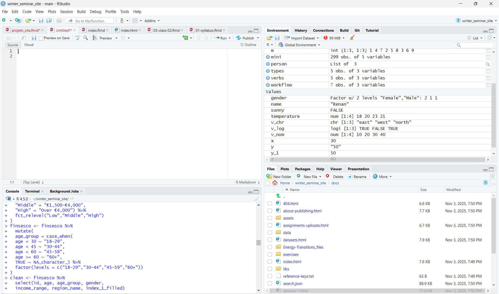

---
title: "Energy-Transitions"
pagetitle: "Energy-Transitions — Class 1"
author: "Renan Magalhães"
output: bookdown::bs4_book
---


# Session 1 {-}

***
## 1. Welcome and Course Overview {-}
<iframe src="https://drive.google.com/file/d/1LDv4pGuqS8NqQPOBkuMcwBT6AKGMzL5g/preview"
        width="640" height="360" allow="autoplay"></iframe>


Welcome to the **Energy Transitions  Seminar**. This course is about learning to *think like a data analyst* in R while working with real data from the energy transition. Each week, we’ll alternate between short explanations and hands-on practice. When you see a new function or concept, try to understand two things: (1) **what** it does, and (2) **why** it’s the right tool for the job. By the end, you’ll be comfortable loading data, cleaning it, summarizing it, visualizing relationships, and fitting introductory econometric models.

We’ll use the **FinSESCo dataset**, which explores how households behave and invest in energy efficiency.  
Throughout the course you’ll:

- handle real-world data,  
- explore variables,  
- and build econometric models step-by-step.

Everything we do is **hands-on** — you’ll code, test, and visualize your own results.

***


### Installing R and RStudio {-}

Download and install:

- [**R**](https://cran.r-project.org/)  
- [**RStudio Desktop**](https://posit.co/download/rstudio-desktop/)

When you open RStudio, you’ll see four panels:

1. **Source** (top-left): scripts or markdown.  
2. **Console** (bottom-left): executes commands.  
3. **Environment / History** (top-right): lists your objects.  
4. **Files / Plots / Packages / Help** (bottom-right): navigation and tools.



::: {.callout-tip}
#### 💡 Tip {-}
RStudio shortcuts speed you up: *Run line* (`Ctrl + Enter`), *Comment/Uncomment* (`Ctrl + Shift + C`), *Find/Replace* (`Ctrl + F`).
:::

***

***

### Installing Packages {-}

R’s power comes from **packages** — sets of functions you add to “base R.”  
Use `install.packages("name_of_the_package")` **once** per machine to download it, and `library(name_of_the_package)` **each session** to load it.

```{r}
install.packages("tidyverse")   # only once
library(tidyverse)              # every session
```

For example, the `tidyverse` bundle gives you: `dplyr` (data manipulation), `ggplot2` (visualization), and `readr` (fast import). You’ll see them often because they standardize syntax and make code readable.

::: {.callout-tip}
#### 💡 Tip {-}
If you see an error like `"there is no package called 'dplyr'"`, install it first with `install.packages("dplyr")`, then load it with `library(dplyr)`.
:::


### Working Directory {-}

The **working directory** is the folder R reads from and writes to by default.  
In projects and books, *avoid* `setwd(...)`. Instead, use **project-relative paths** (e.g., via the `here` package) so your code works on any computer without editing file paths.

getwd()  -> shows the current folder
setwd()  -> set your own path

e.g. setwd("C:/Users/Renan/Documents/finsesco_course")


::: {.callout-note}
#### 📝 Good practice {-}
Keep a clean structure like `data/`, `images/`, and `scripts/`. Load files with paths such as `here::here("data", "finSESCo_sample.csv")`.
:::


## 2. Variable Assignment & Basic Data Types {-}

<iframe src="https://drive.google.com/file/d/1zS_BqOwwUia5KGI53L7Pdh0BPBDmncn2/preview"
        width="640" height="360" allow="autoplay"></iframe>


Everything in R is an **object**. You create or update objects by assignment (prefer the left-arrow `"<-"` because it is idiomatic and visually distinctive). For example, assign a number to `x`, a string to `name`, or a boolean to `sunny`.

```{r}
x <- 30
y <- '50' # character on purpose
name <- "Renan"
sunny <- FALSE
```

R stores values with **types**:
- **numeric** (e.g., `3.14`) for continuous numbers,
- **integer** (e.g., `10L`) for whole numbers,
- **character** (e.g., `"Berlin"`) for text,
- **logical** (`TRUE`/`FALSE`),
- **factor** for labeled categories (internally stored as integers + levels).

You can inspect types with `class(x)` (high-level label) and `typeof(x)` (internal storage).  
You can also convert types with `as.numeric()`, `as.character()`, `as.logical()`, or `as.factor()`. This is called **coercion** and is essential when cleaning survey data that might come in as text.

```{r}
class(x)
class(y)
```
While inspecting the variables, you see that `y` is a character. Therefore you get an error while making operations with it. It is considered a text, not a number as `x`.

```{r, error = TRUE}
x + y
```

```{r}
y_1 <- as.numeric(y)
z <- x + y_1
z
```
Therefore, you should convert `y` as numeric if you want to make operations with `x`.

::: {.callout-tip}
#### 💡 Tip {-}
R is **case-sensitive**: `Income` and `income` are different objects. Prefer lower_case_names for names (e.g., `mean_income`).
:::


Try it yourself:

```{r}
temperature <- c(18, 20, 23, 21)
is.numeric(temperature)
```

Type conversion:

```{r}
as.numeric("5")
as.character(123)
as.factor(c("low", "high", "low"))
```


## 3. Working with R Objects {-}

<iframe src="https://drive.google.com/file/d/1y2HlvjYhx2xoVCNjC4JrloFAo454AyZg/preview"
        width="640" height="360" allow="autoplay"></iframe>


R’s data structures are the building blocks of analysis:

- **Vectors**: one-dimensional, same type. Use `c(...)` to combine values and functions like `length()`, `mean()`, and indexing `[]`.
- **Matrices**: two-dimensional, same type. Useful for linear algebra and certain algorithms; you’ll likely just *recognize* them in Week 1.
- **Factors**: categorical variables with explicit **levels** (e.g., `"low"`, `"medium"`, `"high"`). Factors are crucial for modeling and plotting categories.
- **Data frames**: tables where each column is a vector of the same length. This is your main workhorse for empirical work. Functions like `nrow()`, `names()`, and `str()` help you understand structure.
- **Lists**: containers that can mix types (a model fit often returns a list: coefficients, residuals, fitted values, etc.). Use `$` or `[[ ]]` to access elements.

The **tidyverse** elevates data frames into **tibbles**, which print nicely and behave consistently.


```{r, echo=FALSE}
### Data Type Overview

# Create a data frame describing R's basic data types
data_types <- data.frame(
  Type = c("Numeric", "Integer", "Character", "Logical", "Factor"),
  Example = c("3.14", "10L", "\"Berlin\"", "TRUE, FALSE", "factor(c('Low','High'))"),
  Description = c(
    "Real or decimal numbers",
    "Whole numbers",
    "Text strings",
    "Boolean values",
    "Categorical (labeled) data"
  )
)

# Display the table nicely
knitr::kable(data_types, caption = "Basic Data Types in R")
```


### i) Vectors {-}

A **vector** is a one-dimensional collection of elements of the **same type**. Vectors are the fundamental building block of R.

```{r}
# Creating numeric, character, and logical vectors
v_num  <- c(10, 20, 30, 40)
v_chr  <- c("east", "west", "north")
v_log  <- c(TRUE, FALSE, TRUE)
```

```{r}
v_num
v_chr
v_log
```

You can access elements by **position** (1-based indexing) and perform **vectorized operations**:

```{r}
# Indexing (1-based)
v_num[1]          # first element
v_num[2:3]        # elements 2 through 3
v_num[c(1, 4)]    # elements 1 and 4
```

```{r}
# Vectorized math
v_num + 5
v_num * 2
v_num / v_num     # element-wise division
```

### ii) Matrices {-}

A matrix is a 2D collection (rows × columns) of the same type.

```{r}
m <- matrix(1:9, nrow = 3, byrow = TRUE)
m
m[2, 3]     # element in row 2, column 3
```

### iii) Factors {-}

Factors represent categorical variables (with levels).

```{r}
gender <- factor(c("Male", "Female", "Female"))
levels(gender)
table(gender)

```

### iv) Data Frames {-}

A data frame is a table where each column is a vector of equal length.

```{r}
df <- data.frame(
  id = 1:3,
  income = c(2000, 3500, 2800),
  region = c("East", "West", "West")
)
head(df)
str(df)
```


```{r}
###Basic subsetting:

df$income
df[ , "region"]
df[ df$income > 2500, ]
```


### v) Lists {-}

A list can store elements of different types (useful for model results).

```{r}
person <- list(
  name = "Renan",
  age = 31,
  instruments = c("Guitar", "Bass")
)
person$instruments
person[[1]]      # first element of the list
```


## 4. Exploring Your Dataset {-}

<iframe src="https://drive.google.com/file/d/17N_GEfsiJanlBLsWgYOSnRhj67r84d1W/preview"
        width="640" height="360" allow="autoplay"></iframe>


Let’s import the FinSESCo dataset
(Once you’ve downloaded the `.csv` file from the course repository.)

```{r, message=FALSE}
finsesco <- read_csv(here::here("data", "finSESCo_sample.csv"))
```

In our seminar, we’ll analyze a curated sample of the **FinSESCo** survey. This dataset was collected by the survey company **Norstat** between **28 Aug 2023** and **23 Nov 2023** to study **energy-efficiency behaviors**, **demand-side flexibility**, and **(co-)ownership** patterns among German households. The design intentionally broadened the representation of **female** and **low-income** prosumers relative to earlier waves, aiming for a more balanced view across demographics. While the panel sampling approach means national proportions of prosumers cannot be inferred, the survey targeted representativeness by **age**, **gender**, and **state population distributions**, with adjustments later in fieldwork to reach specific groups of interest. :contentReference[oaicite:0]{index=0}

**Sample size:** 2,585 completed questionnaires  
**Prosumers:** 925 individuals (including 464 women)  
This scale enables comparisons between prosumers and non-prosumers and within prosumer subgroups (e.g., by income and gender). :contentReference[oaicite:1]{index=1}

**Key constructs & questions we’ll use later:**
- **Willingness to invest** in electricity/heating efficiency measures (past actions score + planned actions score).
- **Familiarity with Energy Savings (Performance) Contracting** and **intention to use** a FinSESCo-like platform (transformed from –3…+3 into analytical indices).
- **Drivers** (motivations such as financial, environmental, knowledge, climate concern, energy autonomy, selling excess energy) on Likert scales.
- **Context & demographics**: (co-)ownership, income category, age, gender, education, and more. :contentReference[oaicite:2]{index=2}


When you import tabular data, always **sanity-check**:
- **Preview** the first rows (does it look like a clean table?).
- **Structure**: variable names, types (numeric? character? factor?).
- **Missing values**: how many and where?
- **Ranges**: do minima/maxima make sense?

In R, you’ll use functions like `head()`, `str()`, `summary()`, and `dplyr::glimpse()` for an overview.  
For survey data, expect **missing values** (`NA`). Many functions accept `na.rm = TRUE` to compute summaries on the observed values only. If you forget it, a single `NA` can make a whole summary become `NA`.

::: {.callout-important}
#### 🔴 Important {-}
A variable might *look* numeric but be stored as **character** (e.g., due to non-standard entries). Check with `class()` and coerce thoughtfully with `as.numeric()` after cleaning.
:::


Start by exploring the structure:
```{r}
head(finsesco)
str(finsesco)
glimpse(finsesco)
summary(finsesco)
```

You’ll get a sense of the variables — maybe `income_range`, `age`, `education`, etc.

💡 **Tip**: When you see NA, it means “missing data.” You can remove or ignore them with na.rm = TRUE in most functions.


## 5. Descriptive Statistics {-}

<iframe src="https://drive.google.com/file/d/1tZVRFk8aZYcotOe-q6_UxiclnDOUQGFW/preview"
        width="640" height="360" allow="autoplay"></iframe>


Descriptive statistics tell you what your data looks like before modeling:
- **Central tendency**: `mean()` and `median()` (median is robust to outliers).
- **Spread**: `sd()` (standard deviation) and interquartile range.
- **Distribution shape**: histograms and boxplots to detect skewness and outliers.
- **Counts and proportions**: `table()` for factors; grouped summaries for categories.

With `dplyr`, the flow is:  
**group** → **summarise** → **arrange** (optionally **mutate** to compute new columns).  
For example, you might compute the **average energy spending** by **income group** or the **share of respondents** who report a specific behavior by **ownership type**—these are the first steps toward answering research questions.

::: {.callout-note}
#### 📝 Interpretation mindset
When two groups differ in means, ask: *Is this difference large enough to matter? Stable across subgroups? Driven by outliers?* Plotting complements tables by revealing distribution shape and potential leverage points.
:::


Let’s compute some simple summaries.

```{r}
mean(finsesco$index_1, na.rm = TRUE)
median(finsesco$index_1, na.rm = TRUE)
sd(finsesco$index_1, na.rm = TRUE)

```

Using `dplyr`, we can do this by group:

```{r}
finsesco %>%
  group_by(income_range) %>%
  summarise(mean_index_1 = mean(index_1, na.rm = TRUE))
```

### Your First Plot {-}

Plots are compact summaries. In Week 1, we mainly use:
- **Histogram** (one numeric variable): distribution, skew, possible heaping.
- **Boxplot** (numeric vs. category): medians, spread, and outliers across groups.
- **Bar chart** (counts or summary statistics): proportions or aggregated metrics across categories.

In later weeks, we’ll refine these by adding confidence intervals, transforming axes (e.g., log scale), and layering multiple aesthetics to compare subgroups (e.g., income by ownership).

We’ll use `ggplot2` (included in `tidyverse`) to visualize the relationship between income group and `index_1`, that calculates the willingness to invest in energy efficiency measures.


```{r}
ggplot(finsesco, aes(x = income_range, y = index_1)) +
  geom_boxplot() +
  labs(
    title = "Willingness to invest in Energy Efficiency Measures by Income Group",
    x = "Income Group",
    y = "Index 1"
  )
```

💡 **Try This**:
Change the variable on the y-axis to another numeric column and see how the plot changes!


## Exercise {-}

- **Exercise 01**: **[download Rmd](exercises/ex01/ex01.Rmd)**  
- Upload via **Assignments** page on Moodle.
