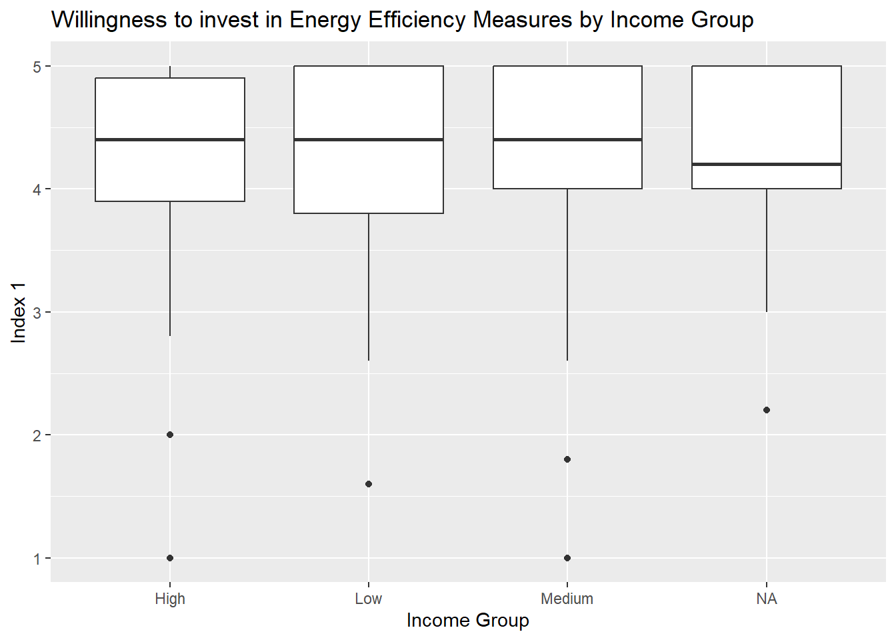

---
title: "Energy Transitions – Winter Semester Seminar"
author: "Renan Magalhães"
site: bookdown::bookdown_site
documentclass: book
description: "Course website with classes, code, videos, datasets, and assignments."
---

# Welcome {-}

Welcome to the seminar! This site hosts **all materials**: syllabus, slides, R code, datasets, and weekly exercises.

> Tip: Use the **left sidebar** to navigate across classes and materials.

## How this site is organized

- **Syllabus** with course policies and schedule  
- **Class pages** (Class 01, Class 02, …) with slides, notes, and code  
- **Assignments** with deadlines and upload links  
- **Datasets** ready to download  
- **About** with contact and credit

To build this site locally, open R and run:

```r
install.packages(c("bookdown", "rmarkdown", "knitr"))
bookdown::render_book("index.Rmd", "bookdown::bs4_book")
```

To publish on GitHub Pages, push the repo and set Pages to serve from the `/docs` folder (see instructions on **About**).


<!--chapter:end:index.Rmd-->


# Syllabus {-}

**University:** European University Viadrina  
**Semester:** Winter 2025/26  
**Instructor:** Renan Magalhães (<magalhaes@kelso-institute-europe.de>)

## Overview {-}

This seminar introduces basic econometric methods in **R** with hands-on work using the FinSESCo dataset.

## Schedule (tentative) {-}

| Week | Date | Topic |
|-----:|:-----|:------|
| 1 | 2025-10-10 | Course intro, R crash course |
| 2 | 2025-10-17 | Data wrangling (dplyr) |
| 3 | 2025-10-24 | Visualization (ggplot2) |
| 4 | 2025-10-31 | Linear models (lm) |
| 5 | 2025-11-07 | Model diagnostics |
| … | … | … |

## Grading {-}

- Participation: 20%  
- Weekly exercises: 40%  
- Final mini‑project: 40%

## Policies {-}

- Late work: see **Assignments** page  
- Collaboration: discuss freely; submit your own work

<!--chapter:end:01-syllabus.Rmd-->


---
title: "Energy-Transitions"
pagetitle: "Energy-Transitions — Class 1"
author: "Renan Magalhães"
output: bookdown::bs4_book
---


# Session 1 {-}

***
## 1. Welcome and Course Overview {-}

<iframe width="720" height="405" src="https://www.youtube.com/embed/dQw4w9WgXcQ" title="Class 01 Recording" frameborder="0" allowfullscreen></iframe>

Welcome to the **Energy Transitions  Seminar**. This course is about learning to *think like a data analyst* in R while working with real data from the energy transition. Each week, we’ll alternate between short explanations and hands-on practice. When you see a new function or concept, try to understand two things: (1) **what** it does, and (2) **why** it’s the right tool for the job. By the end, you’ll be comfortable loading data, cleaning it, summarizing it, visualizing relationships, and fitting introductory econometric models.

We’ll use the **FinSESCo dataset**, which explores how households behave and invest in energy efficiency.  
Throughout the course you’ll:

- handle real-world data,  
- explore variables,  
- and build econometric models step-by-step.

Everything we do is **hands-on** — you’ll code, test, and visualize your own results.

***


### Installing R and RStudio {-}

Download and install:

- [**R**](https://cran.r-project.org/)  
- [**RStudio Desktop**](https://posit.co/download/rstudio-desktop/)

When you open RStudio, you’ll see four panels:

1. **Source** (top-left): scripts or markdown.  
2. **Console** (bottom-left): executes commands.  
3. **Environment / History** (top-right): lists your objects.  
4. **Files / Plots / Packages / Help** (bottom-right): navigation and tools.


::: {.callout-tip}
#### 💡 Tip {-}
RStudio shortcuts speed you up: *Run line* (`Ctrl + Enter`), *Comment/Uncomment* (`Ctrl + Shift + C`), *Find/Replace* (`Ctrl + F`).
:::

***

***

### Installing Packages {-}

R’s power comes from **packages** — sets of functions you add to “base R.”  
Use `install.packages("name_of_the_package")` **once** per machine to download it, and `library(name_of_the_package)` **each session** to load it.


``` r
install.packages("tidyverse")   # only once
library(tidyverse)              # every session
```

For example, the `tidyverse` bundle gives you: `dplyr` (data manipulation), `ggplot2` (visualization), and `readr` (fast import). You’ll see them often because they standardize syntax and make code readable.

::: {.callout-tip}
#### 💡 Tip {-}
If you see an error like `"there is no package called 'dplyr'"`, install it first with `install.packages("dplyr")`, then load it with `library(dplyr)`.
:::


### Working Directory {-}

The **working directory** is the folder R reads from and writes to by default.  
In projects and books, *avoid* `setwd(...)`. Instead, use **project-relative paths** (e.g., via the `here` package) so your code works on any computer without editing file paths.

getwd()  -> shows the current folder
setwd()  -> set your own path

e.g. setwd("C:/Users/Renan/Documents/finsesco_course")


::: {.callout-note}
#### 📝 Good practice {-}
Keep a clean structure like `data/`, `images/`, and `scripts/`. Load files with paths such as `here::here("data", "finSESCo_sample.csv")`.
:::


## 2. Variable Assignment & Basic Data Types {-}

<iframe width="720" height="405" src="https://www.youtube.com/embed/dQw4w9WgXcQ" title="Class 01 Recording" frameborder="0" allowfullscreen></iframe>


Everything in R is an **object**. You create or update objects by assignment (prefer the left-arrow `"<-"` because it is idiomatic and visually distinctive). For example, assign a number to `x`, a string to `name`, or a boolean to `sunny`.


``` r
x <- 30
y <- '50' # character on purpose
name <- "Renan"
sunny <- FALSE
```

R stores values with **types**:
- **numeric** (e.g., `3.14`) for continuous numbers,
- **integer** (e.g., `10L`) for whole numbers,
- **character** (e.g., `"Berlin"`) for text,
- **logical** (`TRUE`/`FALSE`),
- **factor** for labeled categories (internally stored as integers + levels).

You can inspect types with `class(x)` (high-level label) and `typeof(x)` (internal storage).  
You can also convert types with `as.numeric()`, `as.character()`, `as.logical()`, or `as.factor()`. This is called **coercion** and is essential when cleaning survey data that might come in as text.


``` r
class(x)
```

```
## [1] "numeric"
```

``` r
class(y)
```

```
## [1] "character"
```
While inspecting the variables, you see that `y` is a character. Therefore you get an error while making operations with it. It is considered a text, not a number as `x`.


``` r
x + y
```

```
## Error in x + y: non-numeric argument to binary operator
```


``` r
y_1 <- as.numeric(y)
z <- x + y_1
z
```

```
## [1] 80
```
Therefore, you should convert `y` as numeric if you want to make operations with `x`.

::: {.callout-tip}
#### 💡 Tip {-}
R is **case-sensitive**: `Income` and `income` are different objects. Prefer lower_case_names for names (e.g., `mean_income`).
:::


Try it yourself:


``` r
temperature <- c(18, 20, 23, 21)
is.numeric(temperature)
```

```
## [1] TRUE
```

Type conversion:


``` r
as.numeric("5")
```

```
## [1] 5
```

``` r
as.character(123)
```

```
## [1] "123"
```

``` r
as.factor(c("low", "high", "low"))
```

```
## [1] low  high low 
## Levels: high low
```


## 3. Working with R Objects {-}

<iframe width="720" height="405" src="https://www.youtube.com/embed/dQw4w9WgXcQ" title="Class 01 Recording" frameborder="0" allowfullscreen></iframe>


R’s data structures are the building blocks of analysis:

- **Vectors**: one-dimensional, same type. Use `c(...)` to combine values and functions like `length()`, `mean()`, and indexing `[]`.
- **Matrices**: two-dimensional, same type. Useful for linear algebra and certain algorithms; you’ll likely just *recognize* them in Week 1.
- **Factors**: categorical variables with explicit **levels** (e.g., `"low"`, `"medium"`, `"high"`). Factors are crucial for modeling and plotting categories.
- **Data frames**: tables where each column is a vector of the same length. This is your main workhorse for empirical work. Functions like `nrow()`, `names()`, and `str()` help you understand structure.
- **Lists**: containers that can mix types (a model fit often returns a list: coefficients, residuals, fitted values, etc.). Use `$` or `[[ ]]` to access elements.

The **tidyverse** elevates data frames into **tibbles**, which print nicely and behave consistently.


Table: (\#tab:unnamed-chunk-9)Basic Data Types in R

|Type      |Example                 |Description                |
|:---------|:-----------------------|:--------------------------|
|Numeric   |3.14                    |Real or decimal numbers    |
|Integer   |10L                     |Whole numbers              |
|Character |"Berlin"                |Text strings               |
|Logical   |TRUE, FALSE             |Boolean values             |
|Factor    |factor(c('Low','High')) |Categorical (labeled) data |


### i) Vectors {-}

A **vector** is a one-dimensional collection of elements of the **same type**. Vectors are the fundamental building block of R.


``` r
# Creating numeric, character, and logical vectors
v_num  <- c(10, 20, 30, 40)
v_chr  <- c("east", "west", "north")
v_log  <- c(TRUE, FALSE, TRUE)
```


``` r
v_num
```

```
## [1] 10 20 30 40
```

``` r
v_chr
```

```
## [1] "east"  "west"  "north"
```

``` r
v_log
```

```
## [1]  TRUE FALSE  TRUE
```

You can access elements by **position** (1-based indexing) and perform **vectorized operations**:


``` r
# Indexing (1-based)
v_num[1]          # first element
```

```
## [1] 10
```

``` r
v_num[2:3]        # elements 2 through 3
```

```
## [1] 20 30
```

``` r
v_num[c(1, 4)]    # elements 1 and 4
```

```
## [1] 10 40
```


``` r
# Vectorized math
v_num + 5
```

```
## [1] 15 25 35 45
```

``` r
v_num * 2
```

```
## [1] 20 40 60 80
```

``` r
v_num / v_num     # element-wise division
```

```
## [1] 1 1 1 1
```

### ii) Matrices {-}

A matrix is a 2D collection (rows × columns) of the same type.


``` r
m <- matrix(1:9, nrow = 3, byrow = TRUE)
m
```

```
##      [,1] [,2] [,3]
## [1,]    1    2    3
## [2,]    4    5    6
## [3,]    7    8    9
```

``` r
m[2, 3]     # element in row 2, column 3
```

```
## [1] 6
```

### iii) Factors {-}

Factors represent categorical variables (with levels).


``` r
gender <- factor(c("Male", "Female", "Female"))
levels(gender)
```

```
## [1] "Female" "Male"
```

``` r
table(gender)
```

```
## gender
## Female   Male 
##      2      1
```

### iv) Data Frames {-}

A data frame is a table where each column is a vector of equal length.


``` r
df <- data.frame(
  id = 1:3,
  income = c(2000, 3500, 2800),
  region = c("East", "West", "West")
)
head(df)
str(df)
```

```
## 'data.frame':	3 obs. of  3 variables:
##  $ id    : int  1 2 3
##  $ income: num  2000 3500 2800
##  $ region: chr  "East" "West" "West"
```


``` r
###Basic subsetting:

df$income
```

```
## [1] 2000 3500 2800
```

``` r
df[ , "region"]
```

```
## [1] "East" "West" "West"
```

``` r
df[ df$income > 2500, ]
```


### v) Lists {-}

A list can store elements of different types (useful for model results).


``` r
person <- list(
  name = "Renan",
  age = 31,
  instruments = c("Guitar", "Bass")
)
person$instruments
```

```
## [1] "Guitar" "Bass"
```

``` r
person[[1]]      # first element of the list
```

```
## [1] "Renan"
```


## 4. Exploring Your Dataset {-}

<iframe width="720" height="405" src="https://www.youtube.com/embed/dQw4w9WgXcQ" title="Class 01 Recording" frameborder="0" allowfullscreen></iframe>


Let’s import the FinSESCo dataset
(Once you’ve downloaded the `.csv` file from the course repository.)


``` r
finsesco <- read_csv(here::here("data", "finSESCo_sample.csv"))
```

In our seminar, we’ll analyze a curated sample of the **FinSESCo** survey. This dataset was collected by the survey company **Norstat** between **28 Aug 2023** and **23 Nov 2023** to study **energy-efficiency behaviors**, **demand-side flexibility**, and **(co-)ownership** patterns among German households. The design intentionally broadened the representation of **female** and **low-income** prosumers relative to earlier waves, aiming for a more balanced view across demographics. While the panel sampling approach means national proportions of prosumers cannot be inferred, the survey targeted representativeness by **age**, **gender**, and **state population distributions**, with adjustments later in fieldwork to reach specific groups of interest. :contentReference[oaicite:0]{index=0}

**Sample size:** 2,585 completed questionnaires  
**Prosumers:** 925 individuals (including 464 women)  
This scale enables comparisons between prosumers and non-prosumers and within prosumer subgroups (e.g., by income and gender). :contentReference[oaicite:1]{index=1}

**Key constructs & questions we’ll use later:**
- **Willingness to invest** in electricity/heating efficiency measures (past actions score + planned actions score).
- **Familiarity with Energy Savings (Performance) Contracting** and **intention to use** a FinSESCo-like platform (transformed from –3…+3 into analytical indices).
- **Drivers** (motivations such as financial, environmental, knowledge, climate concern, energy autonomy, selling excess energy) on Likert scales.
- **Context & demographics**: (co-)ownership, income category, age, gender, education, and more. :contentReference[oaicite:2]{index=2}


When you import tabular data, always **sanity-check**:
- **Preview** the first rows (does it look like a clean table?).
- **Structure**: variable names, types (numeric? character? factor?).
- **Missing values**: how many and where?
- **Ranges**: do minima/maxima make sense?

In R, you’ll use functions like `head()`, `str()`, `summary()`, and `dplyr::glimpse()` for an overview.  
For survey data, expect **missing values** (`NA`). Many functions accept `na.rm = TRUE` to compute summaries on the observed values only. If you forget it, a single `NA` can make a whole summary become `NA`.

::: {.callout-important}
#### 🔴 Important {-}
A variable might *look* numeric but be stored as **character** (e.g., due to non-standard entries). Check with `class()` and coerce thoughtfully with `as.numeric()` after cleaning.
:::


Start by exploring the structure:

``` r
head(finsesco)
str(finsesco)
```

```
## spc_tbl_ [299 × 32] (S3: spec_tbl_df/tbl_df/tbl/data.frame)
##  $ id               : num [1:299] 1 2 3 4 5 6 7 8 9 10 ...
##  $ income_range     : chr [1:299] "Low" "Low" "High" "Medium" ...
##  $ co_ownership     : num [1:299] 0 0 0 1 0 1 0 0 1 0 ...
##  $ ownership        : num [1:299] 0 0 0 1 0 1 0 0 1 0 ...
##  $ index_1          : num [1:299] 4.4 5 3.4 5 3.6 5 5 3.6 4.2 3 ...
##  $ index_2          : num [1:299] 3.57 5 3.71 5 3 ...
##  $ index_3          : num [1:299] 4 5 2 5 NA 3 NA 3 5 1 ...
##  $ index_4          : num [1:299] 3 5 3 5 NA 1 NA 4 4 1 ...
##  $ index_5          : num [1:299] 4 4 5 1 NA 3 NA 4 2 1 ...
##  $ index_6          : num [1:299] 4.33 4.67 3 3 NA ...
##  $ gender           : num [1:299] 0 1 0 0 0 0 0 0 1 0 ...
##  $ age              : num [1:299] 21.5 63 21.5 58 63 53 53 63 53 63 ...
##  $ age_factor       : chr [1:299] "18-25" "61-65" "18-25" "56-60" ...
##  $ academic         : num [1:299] 0 0 0 0 0 0 0 0 1 0 ...
##  $ income_group     : chr [1:299] "Low" "Low" "High" "Medium" ...
##  $ use_finsesco     : num [1:299] 1 4 2 1 NA 1 NA 1 1 1 ...
##  $ index_finsesco   : num [1:299] 0.73 1.13 0.95 0.73 NA ...
##  $ p_flat           : num [1:299] 1 0 1 0 1 0 1 0 1 1 ...
##  $ p_apartment      : num [1:299] 0 1 0 0 0 0 0 0 0 0 ...
##  $ p_house          : num [1:299] 0 0 0 1 0 1 0 1 0 0 ...
##  $ home_ownership   : num [1:299] 0 0 0 1 0 1 0 1 1 0 ...
##  $ finsesco_familiar: num [1:299] 0 1 0 0 0 0 0 0 0 0 ...
##  $ crowd_yes        : num [1:299] 0 0 0 0 0 0 0 0 0 0 ...
##  $ crowd_own        : num [1:299] 0 0 0 0 0 1 0 0 0 0 ...
##  $ income_low       : num [1:299] 1 1 0 0 1 0 1 1 0 1 ...
##  $ income_med       : num [1:299] 0 0 0 1 0 0 0 0 0 0 ...
##  $ income_high      : num [1:299] 0 0 1 0 0 1 0 0 1 0 ...
##  $ prosumership     : num [1:299] 0 0 0 1 0 1 0 0 1 0 ...
##  $ social_benefit   : num [1:299] 0 0 0 0 0 0 1 0 0 0 ...
##  $ control          : num [1:299] 0 0 0 0 0 0 0 0 1 0 ...
##  $ interact         : num [1:299] 0 0 0 0 0 0 0 0 1 0 ...
##  $ monitor          : num [1:299] 0 0 0 0 0 0 0 0 1 0 ...
##  - attr(*, "spec")=
##   .. cols(
##   ..   id = col_double(),
##   ..   income_range = col_character(),
##   ..   co_ownership = col_double(),
##   ..   ownership = col_double(),
##   ..   index_1 = col_double(),
##   ..   index_2 = col_double(),
##   ..   index_3 = col_double(),
##   ..   index_4 = col_double(),
##   ..   index_5 = col_double(),
##   ..   index_6 = col_double(),
##   ..   gender = col_double(),
##   ..   age = col_double(),
##   ..   age_factor = col_character(),
##   ..   academic = col_double(),
##   ..   income_group = col_character(),
##   ..   use_finsesco = col_double(),
##   ..   index_finsesco = col_double(),
##   ..   p_flat = col_double(),
##   ..   p_apartment = col_double(),
##   ..   p_house = col_double(),
##   ..   home_ownership = col_double(),
##   ..   finsesco_familiar = col_double(),
##   ..   crowd_yes = col_double(),
##   ..   crowd_own = col_double(),
##   ..   income_low = col_double(),
##   ..   income_med = col_double(),
##   ..   income_high = col_double(),
##   ..   prosumership = col_double(),
##   ..   social_benefit = col_double(),
##   ..   control = col_double(),
##   ..   interact = col_double(),
##   ..   monitor = col_double()
##   .. )
##  - attr(*, "problems")=<externalptr>
```

``` r
glimpse(finsesco)
```

```
## Rows: 299
## Columns: 32
## $ id                <dbl> 1, 2, 3, 4, 5, 6, 7, 8, 9, 10, 11, 12, 13, 14, 15, 16, 17, …
## $ income_range      <chr> "Low", "Low", "High", "Medium", "Low", "High", "Low", "Low"…
## $ co_ownership      <dbl> 0, 0, 0, 1, 0, 1, 0, 0, 1, 0, 0, 0, 0, 0, 1, 0, 0, 0, 0, 0,…
## $ ownership         <dbl> 0, 0, 0, 1, 0, 1, 0, 0, 1, 0, 0, 0, 0, 0, 1, 0, 0, 0, 0, 0,…
## $ index_1           <dbl> 4.4, 5.0, 3.4, 5.0, 3.6, 5.0, 5.0, 3.6, 4.2, 3.0, 3.0, 5.0,…
## $ index_2           <dbl> 3.571429, 5.000000, 3.714286, 5.000000, 3.000000, 3.857143,…
## $ index_3           <dbl> 4, 5, 2, 5, NA, 3, NA, 3, 5, 1, 1, 5, 4, 4, 3, 2, 5, 5, 3, …
## $ index_4           <dbl> 3, 5, 3, 5, NA, 1, NA, 4, 4, 1, 1, 5, 5, 5, 4, 4, 5, NA, 2,…
## $ index_5           <dbl> 4, 4, 5, 1, NA, 3, NA, 4, 2, 1, 1, 4, 4, 5, 3, 4, 1, 5, 5, …
## $ index_6           <dbl> 4.333333, 4.666667, 3.000000, 3.000000, NA, 3.666667, NA, 4…
## $ gender            <dbl> 0, 1, 0, 0, 0, 0, 0, 0, 1, 0, 1, 0, 1, 1, 0, 1, 0, 0, 0, 1,…
## $ age               <dbl> 21.5, 63.0, 21.5, 58.0, 63.0, 53.0, 53.0, 63.0, 53.0, 63.0,…
## $ age_factor        <chr> "18-25", "61-65", "18-25", "56-60", "61-65", "51-55", "51-5…
## $ academic          <dbl> 0, 0, 0, 0, 0, 0, 0, 0, 1, 0, 1, 1, 1, 0, 1, 1, 0, 0, 0, 0,…
## $ income_group      <chr> "Low", "Low", "High", "Medium", "Low", "High", "Low", "Low"…
## $ use_finsesco      <dbl> 1, 4, 2, 1, NA, 1, NA, 1, 1, 1, NA, 1, 1, NA, 1, 1, 1, NA, …
## $ index_finsesco    <dbl> 0.7299988, 1.1276756, 0.9498817, 0.7299988, NA, 0.7299988, …
## $ p_flat            <dbl> 1, 0, 1, 0, 1, 0, 1, 0, 1, 1, 0, 1, 0, 1, 0, 0, 0, 0, 0, 1,…
## $ p_apartment       <dbl> 0, 1, 0, 0, 0, 0, 0, 0, 0, 0, 1, 0, 0, 0, 0, 1, 0, 1, 0, 0,…
## $ p_house           <dbl> 0, 0, 0, 1, 0, 1, 0, 1, 0, 0, 0, 0, 1, 0, 1, 0, 1, 0, 1, 0,…
## $ home_ownership    <dbl> 0, 0, 0, 1, 0, 1, 0, 1, 1, 0, 0, 0, 0, 0, 1, 0, 1, 0, 0, 0,…
## $ finsesco_familiar <dbl> 0, 1, 0, 0, 0, 0, 0, 0, 0, 0, 1, 0, 0, 0, 0, 0, 0, 0, 0, 0,…
## $ crowd_yes         <dbl> 0, 0, 0, 0, 0, 0, 0, 0, 0, 0, 0, 0, 0, 0, 0, 0, 0, 0, 0, 0,…
## $ crowd_own         <dbl> 0, 0, 0, 0, 0, 1, 0, 0, 0, 0, 1, 0, 0, 0, 0, 0, 0, 0, 0, 0,…
## $ income_low        <dbl> 1, 1, 0, 0, 1, 0, 1, 1, 0, 1, 0, 0, 0, 0, 0, 0, 0, 1, 0, 0,…
## $ income_med        <dbl> 0, 0, 0, 1, 0, 0, 0, 0, 0, 0, 0, 1, 0, 1, 0, 0, 0, 0, 1, 1,…
## $ income_high       <dbl> 0, 0, 1, 0, 0, 1, 0, 0, 1, 0, 1, 0, 1, 0, 1, 1, 1, 0, 0, 0,…
## $ prosumership      <dbl> 0, 0, 0, 1, 0, 1, 0, 0, 1, 0, 0, 0, 0, 0, 1, 0, 0, 0, 0, 0,…
## $ social_benefit    <dbl> 0, 0, 0, 0, 0, 0, 1, 0, 0, 0, 0, 0, 0, 0, 0, 0, 0, 0, 0, 0,…
## $ control           <dbl> 0, 0, 0, 0, 0, 0, 0, 0, 1, 0, 0, 0, 0, 0, 1, 0, 0, 0, 0, 0,…
## $ interact          <dbl> 0, 0, 0, 0, 0, 0, 0, 0, 1, 0, 0, 0, 0, 0, 1, 0, 0, 0, 0, 0,…
## $ monitor           <dbl> 0, 0, 0, 0, 0, 0, 0, 0, 1, 0, 0, 0, 0, 0, 1, 0, 0, 0, 0, 0,…
```

``` r
summary(finsesco)
```

```
##        id        income_range        co_ownership      ownership        index_1     
##  Min.   :  1.0   Length:299         Min.   :0.0000   Min.   :0.000   Min.   :1.000  
##  1st Qu.: 75.5   Class :character   1st Qu.:0.0000   1st Qu.:0.000   1st Qu.:4.000  
##  Median :150.0   Mode  :character   Median :0.0000   Median :0.000   Median :4.400  
##  Mean   :150.0                      Mean   :0.1104   Mean   :0.194   Mean   :4.281  
##  3rd Qu.:224.5                      3rd Qu.:0.0000   3rd Qu.:0.000   3rd Qu.:5.000  
##  Max.   :299.0                      Max.   :1.0000   Max.   :1.000   Max.   :5.000  
##                                                                                     
##     index_2         index_3         index_4         index_5         index_6     
##  Min.   :1.000   Min.   :1.000   Min.   :1.000   Min.   :1.000   Min.   :1.000  
##  1st Qu.:3.286   1st Qu.:3.000   1st Qu.:2.000   1st Qu.:3.000   1st Qu.:2.500  
##  Median :3.857   Median :4.000   Median :3.000   Median :4.000   Median :3.333  
##  Mean   :3.752   Mean   :3.503   Mean   :3.217   Mean   :3.515   Mean   :3.249  
##  3rd Qu.:4.286   3rd Qu.:5.000   3rd Qu.:5.000   3rd Qu.:5.000   3rd Qu.:4.333  
##  Max.   :5.000   Max.   :5.000   Max.   :5.000   Max.   :5.000   Max.   :5.000  
##  NA's   :3       NA's   :5       NA's   :23      NA's   :6       NA's   :6      
##      gender            age         age_factor           academic    
##  Min.   :0.0000   Min.   :21.50   Length:299         Min.   :0.000  
##  1st Qu.:0.0000   1st Qu.:43.00   Class :character   1st Qu.:0.000  
##  Median :0.0000   Median :53.00   Mode  :character   Median :0.000  
##  Mean   :0.4983   Mean   :51.63                      Mean   :0.311  
##  3rd Qu.:1.0000   3rd Qu.:63.00                      3rd Qu.:1.000  
##  Max.   :1.0000   Max.   :68.00                      Max.   :1.000  
##                                                                     
##  income_group        use_finsesco   index_finsesco       p_flat        p_apartment    
##  Length:299         Min.   :1.000   Min.   :0.7300   Min.   :0.0000   Min.   :0.0000  
##  Class :character   1st Qu.:1.000   1st Qu.:0.7300   1st Qu.:0.0000   1st Qu.:0.0000  
##  Mode  :character   Median :1.000   Median :0.7300   Median :0.0000   Median :0.0000  
##                     Mean   :1.539   Mean   :0.8187   Mean   :0.4448   Mean   :0.2241  
##                     3rd Qu.:2.000   3rd Qu.:0.9499   3rd Qu.:1.0000   3rd Qu.:0.0000  
##                     Max.   :4.000   Max.   :1.1277   Max.   :1.0000   Max.   :1.0000  
##                     NA's   :82      NA's   :82                                        
##     p_house       home_ownership  finsesco_familiar   crowd_yes         crowd_own    
##  Min.   :0.0000   Min.   :0.000   Min.   :0.00000   Min.   :0.00000   Min.   :0.000  
##  1st Qu.:0.0000   1st Qu.:0.000   1st Qu.:0.00000   1st Qu.:0.00000   1st Qu.:0.000  
##  Median :0.0000   Median :0.000   Median :0.00000   Median :0.00000   Median :0.000  
##  Mean   :0.3177   Mean   :0.404   Mean   :0.05724   Mean   :0.01684   Mean   :0.138  
##  3rd Qu.:1.0000   3rd Qu.:1.000   3rd Qu.:0.00000   3rd Qu.:0.00000   3rd Qu.:0.000  
##  Max.   :1.0000   Max.   :1.000   Max.   :1.00000   Max.   :1.00000   Max.   :1.000  
##                   NA's   :2       NA's   :2         NA's   :2         NA's   :2      
##    income_low       income_med      income_high      prosumership   social_benefit  
##  Min.   :0.0000   Min.   :0.0000   Min.   :0.0000   Min.   :0.000   Min.   :0.0000  
##  1st Qu.:0.0000   1st Qu.:0.0000   1st Qu.:0.0000   1st Qu.:0.000   1st Qu.:0.0000  
##  Median :0.0000   Median :0.0000   Median :0.0000   Median :0.000   Median :0.0000  
##  Mean   :0.2843   Mean   :0.3411   Mean   :0.2508   Mean   :0.194   Mean   :0.1137  
##  3rd Qu.:1.0000   3rd Qu.:1.0000   3rd Qu.:0.5000   3rd Qu.:0.000   3rd Qu.:0.0000  
##  Max.   :1.0000   Max.   :1.0000   Max.   :1.0000   Max.   :1.000   Max.   :1.0000  
##                                                                                     
##     control          interact        monitor      
##  Min.   :0.0000   Min.   :0.000   Min.   :0.0000  
##  1st Qu.:0.0000   1st Qu.:0.000   1st Qu.:0.0000  
##  Median :0.0000   Median :0.000   Median :0.0000  
##  Mean   :0.1137   Mean   :0.107   Mean   :0.1338  
##  3rd Qu.:0.0000   3rd Qu.:0.000   3rd Qu.:0.0000  
##  Max.   :1.0000   Max.   :1.000   Max.   :1.0000  
## 
```

You’ll get a sense of the variables — maybe `income_range`, `age`, `education`, etc.

💡 **Tip**: When you see NA, it means “missing data.” You can remove or ignore them with na.rm = TRUE in most functions.


## 5. Descriptive Statistics {-}

<iframe width="720" height="405" src="https://www.youtube.com/embed/dQw4w9WgXcQ" title="Class 01 Recording" frameborder="0" allowfullscreen></iframe>


Descriptive statistics tell you what your data looks like before modeling:
- **Central tendency**: `mean()` and `median()` (median is robust to outliers).
- **Spread**: `sd()` (standard deviation) and interquartile range.
- **Distribution shape**: histograms and boxplots to detect skewness and outliers.
- **Counts and proportions**: `table()` for factors; grouped summaries for categories.

With `dplyr`, the flow is:  
**group** → **summarise** → **arrange** (optionally **mutate** to compute new columns).  
For example, you might compute the **average energy spending** by **income group** or the **share of respondents** who report a specific behavior by **ownership type**—these are the first steps toward answering research questions.

::: {.callout-note}
#### 📝 Interpretation mindset
When two groups differ in means, ask: *Is this difference large enough to matter? Stable across subgroups? Driven by outliers?* Plotting complements tables by revealing distribution shape and potential leverage points.
:::


Let’s compute some simple summaries.


``` r
mean(finsesco$index_1, na.rm = TRUE)
```

```
## [1] 4.281382
```

``` r
median(finsesco$index_1, na.rm = TRUE)
```

```
## [1] 4.4
```

``` r
sd(finsesco$index_1, na.rm = TRUE)
```

```
## [1] 0.7211005
```

Using `dplyr`, we can do this by group:


``` r
finsesco %>%
  group_by(income_range) %>%
  summarise(mean_index_1 = mean(index_1, na.rm = TRUE))
```

### Your First Plot {-}

Plots are compact summaries. In Week 1, we mainly use:
- **Histogram** (one numeric variable): distribution, skew, possible heaping.
- **Boxplot** (numeric vs. category): medians, spread, and outliers across groups.
- **Bar chart** (counts or summary statistics): proportions or aggregated metrics across categories.

In later weeks, we’ll refine these by adding confidence intervals, transforming axes (e.g., log scale), and layering multiple aesthetics to compare subgroups (e.g., income by ownership).

We’ll use `ggplot2` (included in `tidyverse`) to visualize the relationship between income group and `index_1`, that calculates the willingness to invest in energy efficiency measures.


``` r
ggplot(finsesco, aes(x = income_range, y = index_1)) +
  geom_boxplot() +
  labs(
    title = "Willingness to invest in Energy Efficiency Measures by Income Group",
    x = "Income Group",
    y = "Index 1"
  )
```



💡 **Try This**:
Change the variable on the y-axis to another numeric column and see how the plot changes!


## Exercise {-}

- **Exercise 01**: **[download Rmd](exercises/ex01/ex01.Rmd)**  
- Upload via **Assignments** page on Moodle.

<!--chapter:end:02-class-01.Rmd-->


---
title: "Energy-Transitions"
pagetitle: "Energy-Transitions — Class 2"
author: "Renan Magalhães"
output: bookdown::bs4_book
---


# Session 2 {-}

***
## 1. Why Data Cleaning Is the Hardest (and Most Important) Step{-}

<iframe width="720" height="405" src="https://www.youtube.com/embed/dQw4w9WgXcQ" title="Class 02 Recording" frameborder="0" allowfullscreen></iframe>

When researchers talk about “analysis,” they often imagine fancy models and colorful plots.
In reality, most of the work happens before any model is fitted: cleaning, organizing, and validating the raw data. Raw data are almost never ready for analysis. Surveys come back with extra spaces, numbers formatted as text, spelling variations, and missing responses.
If you skip the cleaning stage, every later step—summary statistics, regression, visualization—will quietly give misleading results.

**What “tidy” means**

Hadley Wickham defines tidy data as having three rules:

*1.*Each variable forms a column.
*2.*Each observation forms a row.
*3.*Each value forms a single cell.

Once data satisfy these rules, they can easily be filtered, summarized, plotted, and joined.
Most R packages (especially those in the tidyverse) assume data are tidy.
The cleaning workflow we’ll follow mirrors the professional pipeline:


```{=html}
<div id="bgfemrbulm" style="padding-left:0px;padding-right:0px;padding-top:10px;padding-bottom:10px;overflow-x:auto;overflow-y:auto;width:auto;height:auto;">
<style>#bgfemrbulm table {
  font-family: system-ui, 'Segoe UI', Roboto, Helvetica, Arial, sans-serif, 'Apple Color Emoji', 'Segoe UI Emoji', 'Segoe UI Symbol', 'Noto Color Emoji';
  -webkit-font-smoothing: antialiased;
  -moz-osx-font-smoothing: grayscale;
}

#bgfemrbulm thead, #bgfemrbulm tbody, #bgfemrbulm tfoot, #bgfemrbulm tr, #bgfemrbulm td, #bgfemrbulm th {
  border-style: none;
}

#bgfemrbulm p {
  margin: 0;
  padding: 0;
}

#bgfemrbulm .gt_table {
  display: table;
  border-collapse: collapse;
  line-height: normal;
  margin-left: auto;
  margin-right: auto;
  color: #333333;
  font-size: 16px;
  font-weight: normal;
  font-style: normal;
  background-color: #FFFFFF;
  width: auto;
  border-top-style: solid;
  border-top-width: 2px;
  border-top-color: #A8A8A8;
  border-right-style: none;
  border-right-width: 2px;
  border-right-color: #D3D3D3;
  border-bottom-style: solid;
  border-bottom-width: 2px;
  border-bottom-color: #A8A8A8;
  border-left-style: none;
  border-left-width: 2px;
  border-left-color: #D3D3D3;
}

#bgfemrbulm .gt_caption {
  padding-top: 4px;
  padding-bottom: 4px;
}

#bgfemrbulm .gt_title {
  color: #333333;
  font-size: 125%;
  font-weight: initial;
  padding-top: 4px;
  padding-bottom: 4px;
  padding-left: 5px;
  padding-right: 5px;
  border-bottom-color: #FFFFFF;
  border-bottom-width: 0;
}

#bgfemrbulm .gt_subtitle {
  color: #333333;
  font-size: 85%;
  font-weight: initial;
  padding-top: 3px;
  padding-bottom: 5px;
  padding-left: 5px;
  padding-right: 5px;
  border-top-color: #FFFFFF;
  border-top-width: 0;
}

#bgfemrbulm .gt_heading {
  background-color: #FFFFFF;
  text-align: center;
  border-bottom-color: #FFFFFF;
  border-left-style: none;
  border-left-width: 1px;
  border-left-color: #D3D3D3;
  border-right-style: none;
  border-right-width: 1px;
  border-right-color: #D3D3D3;
}

#bgfemrbulm .gt_bottom_border {
  border-bottom-style: solid;
  border-bottom-width: 2px;
  border-bottom-color: #D3D3D3;
}

#bgfemrbulm .gt_col_headings {
  border-top-style: solid;
  border-top-width: 2px;
  border-top-color: #D3D3D3;
  border-bottom-style: solid;
  border-bottom-width: 2px;
  border-bottom-color: #D3D3D3;
  border-left-style: none;
  border-left-width: 1px;
  border-left-color: #D3D3D3;
  border-right-style: none;
  border-right-width: 1px;
  border-right-color: #D3D3D3;
}

#bgfemrbulm .gt_col_heading {
  color: #333333;
  background-color: #FFFFFF;
  font-size: 100%;
  font-weight: normal;
  text-transform: inherit;
  border-left-style: none;
  border-left-width: 1px;
  border-left-color: #D3D3D3;
  border-right-style: none;
  border-right-width: 1px;
  border-right-color: #D3D3D3;
  vertical-align: bottom;
  padding-top: 5px;
  padding-bottom: 6px;
  padding-left: 5px;
  padding-right: 5px;
  overflow-x: hidden;
}

#bgfemrbulm .gt_column_spanner_outer {
  color: #333333;
  background-color: #FFFFFF;
  font-size: 100%;
  font-weight: normal;
  text-transform: inherit;
  padding-top: 0;
  padding-bottom: 0;
  padding-left: 4px;
  padding-right: 4px;
}

#bgfemrbulm .gt_column_spanner_outer:first-child {
  padding-left: 0;
}

#bgfemrbulm .gt_column_spanner_outer:last-child {
  padding-right: 0;
}

#bgfemrbulm .gt_column_spanner {
  border-bottom-style: solid;
  border-bottom-width: 2px;
  border-bottom-color: #D3D3D3;
  vertical-align: bottom;
  padding-top: 5px;
  padding-bottom: 5px;
  overflow-x: hidden;
  display: inline-block;
  width: 100%;
}

#bgfemrbulm .gt_spanner_row {
  border-bottom-style: hidden;
}

#bgfemrbulm .gt_group_heading {
  padding-top: 8px;
  padding-bottom: 8px;
  padding-left: 5px;
  padding-right: 5px;
  color: #333333;
  background-color: #FFFFFF;
  font-size: 100%;
  font-weight: initial;
  text-transform: inherit;
  border-top-style: solid;
  border-top-width: 2px;
  border-top-color: #D3D3D3;
  border-bottom-style: solid;
  border-bottom-width: 2px;
  border-bottom-color: #D3D3D3;
  border-left-style: none;
  border-left-width: 1px;
  border-left-color: #D3D3D3;
  border-right-style: none;
  border-right-width: 1px;
  border-right-color: #D3D3D3;
  vertical-align: middle;
  text-align: left;
}

#bgfemrbulm .gt_empty_group_heading {
  padding: 0.5px;
  color: #333333;
  background-color: #FFFFFF;
  font-size: 100%;
  font-weight: initial;
  border-top-style: solid;
  border-top-width: 2px;
  border-top-color: #D3D3D3;
  border-bottom-style: solid;
  border-bottom-width: 2px;
  border-bottom-color: #D3D3D3;
  vertical-align: middle;
}

#bgfemrbulm .gt_from_md > :first-child {
  margin-top: 0;
}

#bgfemrbulm .gt_from_md > :last-child {
  margin-bottom: 0;
}

#bgfemrbulm .gt_row {
  padding-top: 8px;
  padding-bottom: 8px;
  padding-left: 5px;
  padding-right: 5px;
  margin: 10px;
  border-top-style: solid;
  border-top-width: 1px;
  border-top-color: #D3D3D3;
  border-left-style: none;
  border-left-width: 1px;
  border-left-color: #D3D3D3;
  border-right-style: none;
  border-right-width: 1px;
  border-right-color: #D3D3D3;
  vertical-align: middle;
  overflow-x: hidden;
}

#bgfemrbulm .gt_stub {
  color: #333333;
  background-color: #FFFFFF;
  font-size: 100%;
  font-weight: initial;
  text-transform: inherit;
  border-right-style: solid;
  border-right-width: 2px;
  border-right-color: #D3D3D3;
  padding-left: 5px;
  padding-right: 5px;
}

#bgfemrbulm .gt_stub_row_group {
  color: #333333;
  background-color: #FFFFFF;
  font-size: 100%;
  font-weight: initial;
  text-transform: inherit;
  border-right-style: solid;
  border-right-width: 2px;
  border-right-color: #D3D3D3;
  padding-left: 5px;
  padding-right: 5px;
  vertical-align: top;
}

#bgfemrbulm .gt_row_group_first td {
  border-top-width: 2px;
}

#bgfemrbulm .gt_row_group_first th {
  border-top-width: 2px;
}

#bgfemrbulm .gt_summary_row {
  color: #333333;
  background-color: #FFFFFF;
  text-transform: inherit;
  padding-top: 8px;
  padding-bottom: 8px;
  padding-left: 5px;
  padding-right: 5px;
}

#bgfemrbulm .gt_first_summary_row {
  border-top-style: solid;
  border-top-color: #D3D3D3;
}

#bgfemrbulm .gt_first_summary_row.thick {
  border-top-width: 2px;
}

#bgfemrbulm .gt_last_summary_row {
  padding-top: 8px;
  padding-bottom: 8px;
  padding-left: 5px;
  padding-right: 5px;
  border-bottom-style: solid;
  border-bottom-width: 2px;
  border-bottom-color: #D3D3D3;
}

#bgfemrbulm .gt_grand_summary_row {
  color: #333333;
  background-color: #FFFFFF;
  text-transform: inherit;
  padding-top: 8px;
  padding-bottom: 8px;
  padding-left: 5px;
  padding-right: 5px;
}

#bgfemrbulm .gt_first_grand_summary_row {
  padding-top: 8px;
  padding-bottom: 8px;
  padding-left: 5px;
  padding-right: 5px;
  border-top-style: double;
  border-top-width: 6px;
  border-top-color: #D3D3D3;
}

#bgfemrbulm .gt_last_grand_summary_row_top {
  padding-top: 8px;
  padding-bottom: 8px;
  padding-left: 5px;
  padding-right: 5px;
  border-bottom-style: double;
  border-bottom-width: 6px;
  border-bottom-color: #D3D3D3;
}

#bgfemrbulm .gt_striped {
  background-color: rgba(128, 128, 128, 0.05);
}

#bgfemrbulm .gt_table_body {
  border-top-style: solid;
  border-top-width: 2px;
  border-top-color: #D3D3D3;
  border-bottom-style: solid;
  border-bottom-width: 2px;
  border-bottom-color: #D3D3D3;
}

#bgfemrbulm .gt_footnotes {
  color: #333333;
  background-color: #FFFFFF;
  border-bottom-style: none;
  border-bottom-width: 2px;
  border-bottom-color: #D3D3D3;
  border-left-style: none;
  border-left-width: 2px;
  border-left-color: #D3D3D3;
  border-right-style: none;
  border-right-width: 2px;
  border-right-color: #D3D3D3;
}

#bgfemrbulm .gt_footnote {
  margin: 0px;
  font-size: 90%;
  padding-top: 4px;
  padding-bottom: 4px;
  padding-left: 5px;
  padding-right: 5px;
}

#bgfemrbulm .gt_sourcenotes {
  color: #333333;
  background-color: #FFFFFF;
  border-bottom-style: none;
  border-bottom-width: 2px;
  border-bottom-color: #D3D3D3;
  border-left-style: none;
  border-left-width: 2px;
  border-left-color: #D3D3D3;
  border-right-style: none;
  border-right-width: 2px;
  border-right-color: #D3D3D3;
}

#bgfemrbulm .gt_sourcenote {
  font-size: 90%;
  padding-top: 4px;
  padding-bottom: 4px;
  padding-left: 5px;
  padding-right: 5px;
}

#bgfemrbulm .gt_left {
  text-align: left;
}

#bgfemrbulm .gt_center {
  text-align: center;
}

#bgfemrbulm .gt_right {
  text-align: right;
  font-variant-numeric: tabular-nums;
}

#bgfemrbulm .gt_font_normal {
  font-weight: normal;
}

#bgfemrbulm .gt_font_bold {
  font-weight: bold;
}

#bgfemrbulm .gt_font_italic {
  font-style: italic;
}

#bgfemrbulm .gt_super {
  font-size: 65%;
}

#bgfemrbulm .gt_footnote_marks {
  font-size: 75%;
  vertical-align: 0.4em;
  position: initial;
}

#bgfemrbulm .gt_asterisk {
  font-size: 100%;
  vertical-align: 0;
}

#bgfemrbulm .gt_indent_1 {
  text-indent: 5px;
}

#bgfemrbulm .gt_indent_2 {
  text-indent: 10px;
}

#bgfemrbulm .gt_indent_3 {
  text-indent: 15px;
}

#bgfemrbulm .gt_indent_4 {
  text-indent: 20px;
}

#bgfemrbulm .gt_indent_5 {
  text-indent: 25px;
}

#bgfemrbulm .katex-display {
  display: inline-flex !important;
  margin-bottom: 0.75em !important;
}

#bgfemrbulm div.Reactable > div.rt-table > div.rt-thead > div.rt-tr.rt-tr-group-header > div.rt-th-group:after {
  height: 0px !important;
}
</style>
<table class="gt_table" data-quarto-disable-processing="false" data-quarto-bootstrap="false">
  <thead>
    <tr class="gt_heading">
      <td colspan="3" class="gt_heading gt_title gt_font_normal gt_bottom_border" style>Data Cleaning Workflow in R</td>
    </tr>
    
    <tr class="gt_col_headings">
      <th class="gt_col_heading gt_columns_bottom_border gt_left" rowspan="1" colspan="1" scope="col" id="Step">Step</th>
      <th class="gt_col_heading gt_columns_bottom_border gt_left" rowspan="1" colspan="1" scope="col" id="Goal">Goal</th>
      <th class="gt_col_heading gt_columns_bottom_border gt_left" rowspan="1" colspan="1" scope="col" id="Example_Functions">Example Functions</th>
    </tr>
  </thead>
  <tbody class="gt_table_body">
    <tr><td headers="Step" class="gt_row gt_left"><span class='gt_from_md'>Import</span></td>
<td headers="Goal" class="gt_row gt_left"><span class='gt_from_md'>Load raw data reliably</span></td>
<td headers="Example_Functions" class="gt_row gt_left"><span class='gt_from_md'>read_csv()</span></td></tr>
    <tr><td headers="Step" class="gt_row gt_left"><span class='gt_from_md'>Inspect</span></td>
<td headers="Goal" class="gt_row gt_left"><span class='gt_from_md'>Understand structure</span></td>
<td headers="Example_Functions" class="gt_row gt_left"><span class='gt_from_md'>glimpse(), summary()</span></td></tr>
    <tr><td headers="Step" class="gt_row gt_left"><span class='gt_from_md'>Clean names/types</span></td>
<td headers="Goal" class="gt_row gt_left"><span class='gt_from_md'>Make columns usable</span></td>
<td headers="Example_Functions" class="gt_row gt_left"><span class='gt_from_md'>janitor::clean_names(), mutate()</span></td></tr>
    <tr><td headers="Step" class="gt_row gt_left"><span class='gt_from_md'>Handle missingness</span></td>
<td headers="Goal" class="gt_row gt_left"><span class='gt_from_md'>Make absence explicit</span></td>
<td headers="Example_Functions" class="gt_row gt_left"><span class='gt_from_md'>is.na(), if_else()</span></td></tr>
    <tr><td headers="Step" class="gt_row gt_left"><span class='gt_from_md'>Recode</span></td>
<td headers="Goal" class="gt_row gt_left"><span class='gt_from_md'>Create consistent categories</span></td>
<td headers="Example_Functions" class="gt_row gt_left"><span class='gt_from_md'>case_when(), fct_recode()</span></td></tr>
    <tr><td headers="Step" class="gt_row gt_left"><span class='gt_from_md'>Verify visually</span></td>
<td headers="Goal" class="gt_row gt_left"><span class='gt_from_md'>Sanity-check patterns</span></td>
<td headers="Example_Functions" class="gt_row gt_left"><span class='gt_from_md'>ggplot()</span></td></tr>
    <tr><td headers="Step" class="gt_row gt_left"><span class='gt_from_md'>Save</span></td>
<td headers="Goal" class="gt_row gt_left"><span class='gt_from_md'>Freeze a clean version</span></td>
<td headers="Example_Functions" class="gt_row gt_left"><span class='gt_from_md'>write_csv()</span></td></tr>
  </tbody>
  
</table>
</div>
```


## 2. Importing and Inspecting the Dataset{-}

We’ll use the same FinSESCo survey introduced in Session 1.
This time we’ll pay close attention to its structure, not yet to its content.


``` r
library(tidyverse)
library(here)
finsesco <- read_csv(here::here("data", "finsesco_dirt.csv"))
```


**How R reads files**

`read_csv()` (from readr) is faster and safer than base R’s `read.csv()`:

- It assumes UTF-8 encoding (so German umlauts, € signs, etc. remain intact).
- It guesses data types by scanning a sample of rows.
- It reports parsing problems instead of silently converting to text.

`here::here()` constructs file paths relative to your R Project root, which makes your script portable between computers and operating systems.


Now look inside:


``` r
glimpse(finsesco)
```

```
## Rows: 299
## Columns: 34
## $ id                 <dbl> 1, 2, 3, 4, 5, 6, 7, 8, 9, 10, 11, 12, 13, 14, 15, 16, 17,…
## $ income_range       <chr> "Low", "Low", "High", "Medium", "Low", "High", "Low", "Low…
## $ co_ownership       <dbl> 0, 0, 0, 1, 0, 1, 0, 0, 1, 0, 0, 0, 0, 0, 1, 0, 0, 0, 0, 0…
## $ ownership          <dbl> 0, 0, 0, 1, 0, 1, 0, 0, 1, 0, 0, 0, 0, 0, 1, 0, 0, 0, 0, 0…
## $ index_1            <dbl> 4.4, 5.0, 3.4, 5.0, 3.6, 5.0, 5.0, 3.6, 4.2, 3.0, 3.0, 5.0…
## $ index_2            <dbl> 3.571429, 5.000000, 3.714286, 5.000000, 3.000000, 3.857143…
## $ index_3            <dbl> 4, 5, 2, 5, NA, 3, NA, 3, 5, 1, 1, 5, 4, 4, 3, 2, 5, 5, 3,…
## $ index_4            <dbl> 3, 5, 3, 5, NA, 1, NA, 4, 4, 1, 1, 5, 5, 5, 4, 4, 5, NA, 2…
## $ index_5            <dbl> 4, 4, 5, 1, NA, 3, NA, 4, 2, 1, 1, 4, 4, 5, 3, 4, 1, 5, 5,…
## $ index_6            <dbl> 4.333333, 4.666667, 3.000000, 3.000000, NA, 3.666667, NA, …
## $ gender             <dbl> 0, 1, 0, 0, 0, 0, 0, 0, 1, 0, 1, 0, 1, 1, 0, 1, 0, 0, 0, 1…
## $ age                <dbl> 21.5, 63.0, 21.5, 58.0, 63.0, 53.0, 53.0, 63.0, 53.0, 63.0…
## $ age_factor         <chr> "18-25", "61-65", "18-25", "56-60", "61-65", "51-55", "51-…
## $ academic           <dbl> 0, 0, 0, 0, 0, 0, 0, 0, 1, 0, 1, 1, 1, 0, 1, 1, 0, 0, 0, 0…
## $ income_group       <chr> "Low", "Low", "High", "Medium", "Low", "High", "Low", "Low…
## $ use_finsesco       <dbl> 1, 4, 2, 1, NA, 1, NA, 1, 1, 1, NA, 1, 1, NA, 1, 1, 1, NA,…
## $ index_finsesco     <dbl> 0.7299988, 1.1276756, 0.9498817, 0.7299988, NA, 0.7299988,…
## $ p_flat             <dbl> 1, 0, 1, 0, 1, 0, 1, 0, 1, 1, 0, 1, 0, 1, 0, 0, 0, 0, 0, 1…
## $ p_apartment        <dbl> 0, 1, 0, 0, 0, 0, 0, 0, 0, 0, 1, 0, 0, 0, 0, 1, 0, 1, 0, 0…
## $ p_house            <dbl> 0, 0, 0, 1, 0, 1, 0, 1, 0, 0, 0, 0, 1, 0, 1, 0, 1, 0, 1, 0…
## $ home_ownership     <dbl> 0, 0, 0, 1, 0, 1, 0, 1, 1, 0, 0, 0, 0, 0, 1, 0, 1, 0, 0, 0…
## $ finsesco_familiar  <dbl> 0, 1, 0, 0, 0, 0, 0, 0, 0, 0, 1, 0, 0, 0, 0, 0, 0, 0, 0, 0…
## $ crowd_yes          <dbl> 0, 0, 0, 0, 0, 0, 0, 0, 0, 0, 0, 0, 0, 0, 0, 0, 0, 0, 0, 0…
## $ crowd_own          <dbl> 0, 0, 0, 0, 0, 1, 0, 0, 0, 0, 1, 0, 0, 0, 0, 0, 0, 0, 0, 0…
## $ income_low         <dbl> 1, 1, 0, 0, 1, 0, 1, 1, 0, 1, 0, 0, 0, 0, 0, 0, 0, 1, 0, 0…
## $ income_med         <dbl> 0, 0, 0, 1, 0, 0, 0, 0, 0, 0, 0, 1, 0, 1, 0, 0, 0, 0, 1, 1…
## $ income_high        <dbl> 0, 0, 1, 0, 0, 1, 0, 0, 1, 0, 1, 0, 1, 0, 1, 1, 1, 0, 0, 0…
## $ prosumership       <dbl> 0, 0, 0, 1, 0, 1, 0, 0, 1, 0, 0, 0, 0, 0, 1, 0, 0, 0, 0, 0…
## $ social_benefit     <dbl> 0, 0, 0, 0, 0, 0, 1, 0, 0, 0, 0, 0, 0, 0, 0, 0, 0, 0, 0, 0…
## $ control            <dbl> 0, 0, 0, 0, 0, 0, 0, 0, 1, 0, 0, 0, 0, 0, 1, 0, 0, 0, 0, 0…
## $ interact           <dbl> 0, 0, 0, 0, 0, 0, 0, 0, 1, 0, 0, 0, 0, 0, 1, 0, 0, 0, 0, 0…
## $ monitor            <dbl> 0, 0, 0, 0, 0, 0, 0, 0, 1, 0, 0, 0, 0, 0, 1, 0, 0, 0, 0, 0…
## $ `Income Range`     <dbl> 1143.789, 1394.153, 4948.919, NA, 1470.234, 5273.978, 1264…
## $ `Income Range (€)` <dbl> 1143.789, 1394.153, 4948.919, NA, 1470.234, 5273.978, 1264…
```

``` r
summary(finsesco)
```

```
##        id        income_range        co_ownership      ownership        index_1     
##  Min.   :  1.0   Length:299         Min.   :0.0000   Min.   :0.000   Min.   :1.000  
##  1st Qu.: 75.5   Class :character   1st Qu.:0.0000   1st Qu.:0.000   1st Qu.:4.000  
##  Median :150.0   Mode  :character   Median :0.0000   Median :0.000   Median :4.400  
##  Mean   :150.0                      Mean   :0.1104   Mean   :0.194   Mean   :4.281  
##  3rd Qu.:224.5                      3rd Qu.:0.0000   3rd Qu.:0.000   3rd Qu.:5.000  
##  Max.   :299.0                      Max.   :1.0000   Max.   :1.000   Max.   :5.000  
##                                                                                     
##     index_2         index_3         index_4         index_5         index_6     
##  Min.   :1.000   Min.   :1.000   Min.   :1.000   Min.   :1.000   Min.   :1.000  
##  1st Qu.:3.286   1st Qu.:3.000   1st Qu.:2.000   1st Qu.:3.000   1st Qu.:2.500  
##  Median :3.857   Median :4.000   Median :3.000   Median :4.000   Median :3.333  
##  Mean   :3.752   Mean   :3.503   Mean   :3.217   Mean   :3.515   Mean   :3.249  
##  3rd Qu.:4.286   3rd Qu.:5.000   3rd Qu.:5.000   3rd Qu.:5.000   3rd Qu.:4.333  
##  Max.   :5.000   Max.   :5.000   Max.   :5.000   Max.   :5.000   Max.   :5.000  
##  NA's   :3       NA's   :5       NA's   :23      NA's   :6       NA's   :6      
##      gender            age         age_factor           academic    
##  Min.   :0.0000   Min.   :21.50   Length:299         Min.   :0.000  
##  1st Qu.:0.0000   1st Qu.:43.00   Class :character   1st Qu.:0.000  
##  Median :0.0000   Median :53.00   Mode  :character   Median :0.000  
##  Mean   :0.4983   Mean   :51.63                      Mean   :0.311  
##  3rd Qu.:1.0000   3rd Qu.:63.00                      3rd Qu.:1.000  
##  Max.   :1.0000   Max.   :68.00                      Max.   :1.000  
##                                                                     
##  income_group        use_finsesco   index_finsesco       p_flat        p_apartment    
##  Length:299         Min.   :1.000   Min.   :0.7300   Min.   :0.0000   Min.   :0.0000  
##  Class :character   1st Qu.:1.000   1st Qu.:0.7300   1st Qu.:0.0000   1st Qu.:0.0000  
##  Mode  :character   Median :1.000   Median :0.7300   Median :0.0000   Median :0.0000  
##                     Mean   :1.539   Mean   :0.8187   Mean   :0.4448   Mean   :0.2241  
##                     3rd Qu.:2.000   3rd Qu.:0.9499   3rd Qu.:1.0000   3rd Qu.:0.0000  
##                     Max.   :4.000   Max.   :1.1277   Max.   :1.0000   Max.   :1.0000  
##                     NA's   :82      NA's   :82                                        
##     p_house       home_ownership  finsesco_familiar   crowd_yes         crowd_own    
##  Min.   :0.0000   Min.   :0.000   Min.   :0.00000   Min.   :0.00000   Min.   :0.000  
##  1st Qu.:0.0000   1st Qu.:0.000   1st Qu.:0.00000   1st Qu.:0.00000   1st Qu.:0.000  
##  Median :0.0000   Median :0.000   Median :0.00000   Median :0.00000   Median :0.000  
##  Mean   :0.3177   Mean   :0.404   Mean   :0.05724   Mean   :0.01684   Mean   :0.138  
##  3rd Qu.:1.0000   3rd Qu.:1.000   3rd Qu.:0.00000   3rd Qu.:0.00000   3rd Qu.:0.000  
##  Max.   :1.0000   Max.   :1.000   Max.   :1.00000   Max.   :1.00000   Max.   :1.000  
##                   NA's   :2       NA's   :2         NA's   :2         NA's   :2      
##    income_low       income_med      income_high      prosumership   social_benefit  
##  Min.   :0.0000   Min.   :0.0000   Min.   :0.0000   Min.   :0.000   Min.   :0.0000  
##  1st Qu.:0.0000   1st Qu.:0.0000   1st Qu.:0.0000   1st Qu.:0.000   1st Qu.:0.0000  
##  Median :0.0000   Median :0.0000   Median :0.0000   Median :0.000   Median :0.0000  
##  Mean   :0.2843   Mean   :0.3411   Mean   :0.2508   Mean   :0.194   Mean   :0.1137  
##  3rd Qu.:1.0000   3rd Qu.:1.0000   3rd Qu.:0.5000   3rd Qu.:0.000   3rd Qu.:0.0000  
##  Max.   :1.0000   Max.   :1.0000   Max.   :1.0000   Max.   :1.000   Max.   :1.0000  
##                                                                                     
##     control          interact        monitor        Income Range  Income Range (€)
##  Min.   :0.0000   Min.   :0.000   Min.   :0.0000   Min.   :1005   Min.   :1005    
##  1st Qu.:0.0000   1st Qu.:0.000   1st Qu.:0.0000   1st Qu.:1236   1st Qu.:1236    
##  Median :0.0000   Median :0.000   Median :0.0000   Median :1481   Median :1481    
##  Mean   :0.1137   Mean   :0.107   Mean   :0.1338   Mean   :3443   Mean   :3443    
##  3rd Qu.:0.0000   3rd Qu.:0.000   3rd Qu.:0.0000   3rd Qu.:5710   3rd Qu.:5710    
##  Max.   :1.0000   Max.   :1.000   Max.   :1.0000   Max.   :7980   Max.   :7980    
##                                                    NA's   :139    NA's   :139
```

`glimpse()` prints one line per variable, showing type and first values; `summary()` gives numeric summaries or category counts.


Rows: 2,585
Columns: 45
$ Age                <chr> "32", "45", "63", "28", …
$ Income Range (€)   <chr> "2,500–4,000", "4,000–6,000", …
$ Gender             <chr> "Female", "Male", …


You can already you spot issues:

- `Age` is stored as character, not numeric.
- Column !!!!! contain spaces and symbols.
- There are multiple inconsistent formats for `income`.

Before cleaning, it helps to know what R thinks each type means:


```{=html}
<div id="iwhhxosain" style="padding-left:0px;padding-right:0px;padding-top:10px;padding-bottom:10px;overflow-x:auto;overflow-y:auto;width:auto;height:auto;">
<style>#iwhhxosain table {
  font-family: system-ui, 'Segoe UI', Roboto, Helvetica, Arial, sans-serif, 'Apple Color Emoji', 'Segoe UI Emoji', 'Segoe UI Symbol', 'Noto Color Emoji';
  -webkit-font-smoothing: antialiased;
  -moz-osx-font-smoothing: grayscale;
}

#iwhhxosain thead, #iwhhxosain tbody, #iwhhxosain tfoot, #iwhhxosain tr, #iwhhxosain td, #iwhhxosain th {
  border-style: none;
}

#iwhhxosain p {
  margin: 0;
  padding: 0;
}

#iwhhxosain .gt_table {
  display: table;
  border-collapse: collapse;
  line-height: normal;
  margin-left: auto;
  margin-right: auto;
  color: #333333;
  font-size: 16px;
  font-weight: normal;
  font-style: normal;
  background-color: #FFFFFF;
  width: auto;
  border-top-style: solid;
  border-top-width: 2px;
  border-top-color: #A8A8A8;
  border-right-style: none;
  border-right-width: 2px;
  border-right-color: #D3D3D3;
  border-bottom-style: solid;
  border-bottom-width: 2px;
  border-bottom-color: #A8A8A8;
  border-left-style: none;
  border-left-width: 2px;
  border-left-color: #D3D3D3;
}

#iwhhxosain .gt_caption {
  padding-top: 4px;
  padding-bottom: 4px;
}

#iwhhxosain .gt_title {
  color: #333333;
  font-size: 125%;
  font-weight: initial;
  padding-top: 4px;
  padding-bottom: 4px;
  padding-left: 5px;
  padding-right: 5px;
  border-bottom-color: #FFFFFF;
  border-bottom-width: 0;
}

#iwhhxosain .gt_subtitle {
  color: #333333;
  font-size: 85%;
  font-weight: initial;
  padding-top: 3px;
  padding-bottom: 5px;
  padding-left: 5px;
  padding-right: 5px;
  border-top-color: #FFFFFF;
  border-top-width: 0;
}

#iwhhxosain .gt_heading {
  background-color: #FFFFFF;
  text-align: center;
  border-bottom-color: #FFFFFF;
  border-left-style: none;
  border-left-width: 1px;
  border-left-color: #D3D3D3;
  border-right-style: none;
  border-right-width: 1px;
  border-right-color: #D3D3D3;
}

#iwhhxosain .gt_bottom_border {
  border-bottom-style: solid;
  border-bottom-width: 2px;
  border-bottom-color: #D3D3D3;
}

#iwhhxosain .gt_col_headings {
  border-top-style: solid;
  border-top-width: 2px;
  border-top-color: #D3D3D3;
  border-bottom-style: solid;
  border-bottom-width: 2px;
  border-bottom-color: #D3D3D3;
  border-left-style: none;
  border-left-width: 1px;
  border-left-color: #D3D3D3;
  border-right-style: none;
  border-right-width: 1px;
  border-right-color: #D3D3D3;
}

#iwhhxosain .gt_col_heading {
  color: #333333;
  background-color: #FFFFFF;
  font-size: 100%;
  font-weight: normal;
  text-transform: inherit;
  border-left-style: none;
  border-left-width: 1px;
  border-left-color: #D3D3D3;
  border-right-style: none;
  border-right-width: 1px;
  border-right-color: #D3D3D3;
  vertical-align: bottom;
  padding-top: 5px;
  padding-bottom: 6px;
  padding-left: 5px;
  padding-right: 5px;
  overflow-x: hidden;
}

#iwhhxosain .gt_column_spanner_outer {
  color: #333333;
  background-color: #FFFFFF;
  font-size: 100%;
  font-weight: normal;
  text-transform: inherit;
  padding-top: 0;
  padding-bottom: 0;
  padding-left: 4px;
  padding-right: 4px;
}

#iwhhxosain .gt_column_spanner_outer:first-child {
  padding-left: 0;
}

#iwhhxosain .gt_column_spanner_outer:last-child {
  padding-right: 0;
}

#iwhhxosain .gt_column_spanner {
  border-bottom-style: solid;
  border-bottom-width: 2px;
  border-bottom-color: #D3D3D3;
  vertical-align: bottom;
  padding-top: 5px;
  padding-bottom: 5px;
  overflow-x: hidden;
  display: inline-block;
  width: 100%;
}

#iwhhxosain .gt_spanner_row {
  border-bottom-style: hidden;
}

#iwhhxosain .gt_group_heading {
  padding-top: 8px;
  padding-bottom: 8px;
  padding-left: 5px;
  padding-right: 5px;
  color: #333333;
  background-color: #FFFFFF;
  font-size: 100%;
  font-weight: initial;
  text-transform: inherit;
  border-top-style: solid;
  border-top-width: 2px;
  border-top-color: #D3D3D3;
  border-bottom-style: solid;
  border-bottom-width: 2px;
  border-bottom-color: #D3D3D3;
  border-left-style: none;
  border-left-width: 1px;
  border-left-color: #D3D3D3;
  border-right-style: none;
  border-right-width: 1px;
  border-right-color: #D3D3D3;
  vertical-align: middle;
  text-align: left;
}

#iwhhxosain .gt_empty_group_heading {
  padding: 0.5px;
  color: #333333;
  background-color: #FFFFFF;
  font-size: 100%;
  font-weight: initial;
  border-top-style: solid;
  border-top-width: 2px;
  border-top-color: #D3D3D3;
  border-bottom-style: solid;
  border-bottom-width: 2px;
  border-bottom-color: #D3D3D3;
  vertical-align: middle;
}

#iwhhxosain .gt_from_md > :first-child {
  margin-top: 0;
}

#iwhhxosain .gt_from_md > :last-child {
  margin-bottom: 0;
}

#iwhhxosain .gt_row {
  padding-top: 8px;
  padding-bottom: 8px;
  padding-left: 5px;
  padding-right: 5px;
  margin: 10px;
  border-top-style: solid;
  border-top-width: 1px;
  border-top-color: #D3D3D3;
  border-left-style: none;
  border-left-width: 1px;
  border-left-color: #D3D3D3;
  border-right-style: none;
  border-right-width: 1px;
  border-right-color: #D3D3D3;
  vertical-align: middle;
  overflow-x: hidden;
}

#iwhhxosain .gt_stub {
  color: #333333;
  background-color: #FFFFFF;
  font-size: 100%;
  font-weight: initial;
  text-transform: inherit;
  border-right-style: solid;
  border-right-width: 2px;
  border-right-color: #D3D3D3;
  padding-left: 5px;
  padding-right: 5px;
}

#iwhhxosain .gt_stub_row_group {
  color: #333333;
  background-color: #FFFFFF;
  font-size: 100%;
  font-weight: initial;
  text-transform: inherit;
  border-right-style: solid;
  border-right-width: 2px;
  border-right-color: #D3D3D3;
  padding-left: 5px;
  padding-right: 5px;
  vertical-align: top;
}

#iwhhxosain .gt_row_group_first td {
  border-top-width: 2px;
}

#iwhhxosain .gt_row_group_first th {
  border-top-width: 2px;
}

#iwhhxosain .gt_summary_row {
  color: #333333;
  background-color: #FFFFFF;
  text-transform: inherit;
  padding-top: 8px;
  padding-bottom: 8px;
  padding-left: 5px;
  padding-right: 5px;
}

#iwhhxosain .gt_first_summary_row {
  border-top-style: solid;
  border-top-color: #D3D3D3;
}

#iwhhxosain .gt_first_summary_row.thick {
  border-top-width: 2px;
}

#iwhhxosain .gt_last_summary_row {
  padding-top: 8px;
  padding-bottom: 8px;
  padding-left: 5px;
  padding-right: 5px;
  border-bottom-style: solid;
  border-bottom-width: 2px;
  border-bottom-color: #D3D3D3;
}

#iwhhxosain .gt_grand_summary_row {
  color: #333333;
  background-color: #FFFFFF;
  text-transform: inherit;
  padding-top: 8px;
  padding-bottom: 8px;
  padding-left: 5px;
  padding-right: 5px;
}

#iwhhxosain .gt_first_grand_summary_row {
  padding-top: 8px;
  padding-bottom: 8px;
  padding-left: 5px;
  padding-right: 5px;
  border-top-style: double;
  border-top-width: 6px;
  border-top-color: #D3D3D3;
}

#iwhhxosain .gt_last_grand_summary_row_top {
  padding-top: 8px;
  padding-bottom: 8px;
  padding-left: 5px;
  padding-right: 5px;
  border-bottom-style: double;
  border-bottom-width: 6px;
  border-bottom-color: #D3D3D3;
}

#iwhhxosain .gt_striped {
  background-color: rgba(128, 128, 128, 0.05);
}

#iwhhxosain .gt_table_body {
  border-top-style: solid;
  border-top-width: 2px;
  border-top-color: #D3D3D3;
  border-bottom-style: solid;
  border-bottom-width: 2px;
  border-bottom-color: #D3D3D3;
}

#iwhhxosain .gt_footnotes {
  color: #333333;
  background-color: #FFFFFF;
  border-bottom-style: none;
  border-bottom-width: 2px;
  border-bottom-color: #D3D3D3;
  border-left-style: none;
  border-left-width: 2px;
  border-left-color: #D3D3D3;
  border-right-style: none;
  border-right-width: 2px;
  border-right-color: #D3D3D3;
}

#iwhhxosain .gt_footnote {
  margin: 0px;
  font-size: 90%;
  padding-top: 4px;
  padding-bottom: 4px;
  padding-left: 5px;
  padding-right: 5px;
}

#iwhhxosain .gt_sourcenotes {
  color: #333333;
  background-color: #FFFFFF;
  border-bottom-style: none;
  border-bottom-width: 2px;
  border-bottom-color: #D3D3D3;
  border-left-style: none;
  border-left-width: 2px;
  border-left-color: #D3D3D3;
  border-right-style: none;
  border-right-width: 2px;
  border-right-color: #D3D3D3;
}

#iwhhxosain .gt_sourcenote {
  font-size: 90%;
  padding-top: 4px;
  padding-bottom: 4px;
  padding-left: 5px;
  padding-right: 5px;
}

#iwhhxosain .gt_left {
  text-align: left;
}

#iwhhxosain .gt_center {
  text-align: center;
}

#iwhhxosain .gt_right {
  text-align: right;
  font-variant-numeric: tabular-nums;
}

#iwhhxosain .gt_font_normal {
  font-weight: normal;
}

#iwhhxosain .gt_font_bold {
  font-weight: bold;
}

#iwhhxosain .gt_font_italic {
  font-style: italic;
}

#iwhhxosain .gt_super {
  font-size: 65%;
}

#iwhhxosain .gt_footnote_marks {
  font-size: 75%;
  vertical-align: 0.4em;
  position: initial;
}

#iwhhxosain .gt_asterisk {
  font-size: 100%;
  vertical-align: 0;
}

#iwhhxosain .gt_indent_1 {
  text-indent: 5px;
}

#iwhhxosain .gt_indent_2 {
  text-indent: 10px;
}

#iwhhxosain .gt_indent_3 {
  text-indent: 15px;
}

#iwhhxosain .gt_indent_4 {
  text-indent: 20px;
}

#iwhhxosain .gt_indent_5 {
  text-indent: 25px;
}

#iwhhxosain .katex-display {
  display: inline-flex !important;
  margin-bottom: 0.75em !important;
}

#iwhhxosain div.Reactable > div.rt-table > div.rt-thead > div.rt-tr.rt-tr-group-header > div.rt-th-group:after {
  height: 0px !important;
}
</style>
<table class="gt_table" data-quarto-disable-processing="false" data-quarto-bootstrap="false">
  <thead>
    <tr class="gt_heading">
      <td colspan="3" class="gt_heading gt_title gt_font_normal gt_bottom_border" style>Overview of R Data Types</td>
    </tr>
    
    <tr class="gt_col_headings">
      <th class="gt_col_heading gt_columns_bottom_border gt_left" rowspan="1" colspan="1" scope="col" id="R-Type">R Type</th>
      <th class="gt_col_heading gt_columns_bottom_border gt_left" rowspan="1" colspan="1" scope="col" id="What-It-Represents">What It Represents</th>
      <th class="gt_col_heading gt_columns_bottom_border gt_left" rowspan="1" colspan="1" scope="col" id="Common-Problems">Common Problems</th>
    </tr>
  </thead>
  <tbody class="gt_table_body">
    <tr><td headers="R Type" class="gt_row gt_left">character</td>
<td headers="What It Represents" class="gt_row gt_left">text</td>
<td headers="Common Problems" class="gt_row gt_left">numbers read as text</td></tr>
    <tr><td headers="R Type" class="gt_row gt_left">numeric</td>
<td headers="What It Represents" class="gt_row gt_left">decimal numbers</td>
<td headers="Common Problems" class="gt_row gt_left">missing decimals → integers</td></tr>
    <tr><td headers="R Type" class="gt_row gt_left">integer</td>
<td headers="What It Represents" class="gt_row gt_left">whole numbers</td>
<td headers="Common Problems" class="gt_row gt_left">rarely a problem</td></tr>
    <tr><td headers="R Type" class="gt_row gt_left">factor</td>
<td headers="What It Represents" class="gt_row gt_left">categorical labels</td>
<td headers="Common Problems" class="gt_row gt_left">wrong order or encoding</td></tr>
    <tr><td headers="R Type" class="gt_row gt_left">logical</td>
<td headers="What It Represents" class="gt_row gt_left">TRUE/FALSE flags</td>
<td headers="Common Problems" class="gt_row gt_left">blanks become NA</td></tr>
  </tbody>
  
</table>
</div>
```


Check data types with `sapply(finsesco, class)` if you’re unsure.

::: {.callout-tip}

💡 Tip {-}

R’s type system is strict: `"42"` (character) is not the same as `42` (numeric).
Whenever arithmetic fails, first check the variable’s type.
:::


## 3. Cleaning Column Names and Correcting Types{-}


**Why clean names?**

Messy names make scripts fragile. Every time you use spaces or special characters, you have to surround the name with backticks, e.g. `Income Range (€)`.
`janitor::clean_names()` automatically fixes this by converting all names to lower_snake_case and stripping illegal characters.


``` r
library(janitor)

finsesco <- finsesco %>%
  clean_names() %>%
  mutate(age = as.integer(age),income_range = as.factor(income_range))
```


**Step-by-step explanation**

- `clean_names()` renames columns like `Income Range (€)` → `income_range_eur`. It also ensures uniqueness—if two columns share the same label, it appends _2, _3, etc.
- `mutate()` lets us change columns in-place.
- `as.integer(age)` converts character digits into true numbers.
- `as.factor(income_range)` tells R this is a categorical variable.

Re-inspect:


``` r
glimpse(finsesco)
```

```
## Rows: 299
## Columns: 34
## $ id                <dbl> 1, 2, 3, 4, 5, 6, 7, 8, 9, 10, 11, 12, 13, 14, 15, 16, 17, …
## $ income_range      <fct> Low, Low, High, Medium, Low, High, Low, Low, High, Low, Hig…
## $ co_ownership      <dbl> 0, 0, 0, 1, 0, 1, 0, 0, 1, 0, 0, 0, 0, 0, 1, 0, 0, 0, 0, 0,…
## $ ownership         <dbl> 0, 0, 0, 1, 0, 1, 0, 0, 1, 0, 0, 0, 0, 0, 1, 0, 0, 0, 0, 0,…
## $ index_1           <dbl> 4.4, 5.0, 3.4, 5.0, 3.6, 5.0, 5.0, 3.6, 4.2, 3.0, 3.0, 5.0,…
## $ index_2           <dbl> 3.571429, 5.000000, 3.714286, 5.000000, 3.000000, 3.857143,…
## $ index_3           <dbl> 4, 5, 2, 5, NA, 3, NA, 3, 5, 1, 1, 5, 4, 4, 3, 2, 5, 5, 3, …
## $ index_4           <dbl> 3, 5, 3, 5, NA, 1, NA, 4, 4, 1, 1, 5, 5, 5, 4, 4, 5, NA, 2,…
## $ index_5           <dbl> 4, 4, 5, 1, NA, 3, NA, 4, 2, 1, 1, 4, 4, 5, 3, 4, 1, 5, 5, …
## $ index_6           <dbl> 4.333333, 4.666667, 3.000000, 3.000000, NA, 3.666667, NA, 4…
## $ gender            <dbl> 0, 1, 0, 0, 0, 0, 0, 0, 1, 0, 1, 0, 1, 1, 0, 1, 0, 0, 0, 1,…
## $ age               <int> 21, 63, 21, 58, 63, 53, 53, 63, 53, 63, 38, 53, 68, 21, 28,…
## $ age_factor        <chr> "18-25", "61-65", "18-25", "56-60", "61-65", "51-55", "51-5…
## $ academic          <dbl> 0, 0, 0, 0, 0, 0, 0, 0, 1, 0, 1, 1, 1, 0, 1, 1, 0, 0, 0, 0,…
## $ income_group      <chr> "Low", "Low", "High", "Medium", "Low", "High", "Low", "Low"…
## $ use_finsesco      <dbl> 1, 4, 2, 1, NA, 1, NA, 1, 1, 1, NA, 1, 1, NA, 1, 1, 1, NA, …
## $ index_finsesco    <dbl> 0.7299988, 1.1276756, 0.9498817, 0.7299988, NA, 0.7299988, …
## $ p_flat            <dbl> 1, 0, 1, 0, 1, 0, 1, 0, 1, 1, 0, 1, 0, 1, 0, 0, 0, 0, 0, 1,…
## $ p_apartment       <dbl> 0, 1, 0, 0, 0, 0, 0, 0, 0, 0, 1, 0, 0, 0, 0, 1, 0, 1, 0, 0,…
## $ p_house           <dbl> 0, 0, 0, 1, 0, 1, 0, 1, 0, 0, 0, 0, 1, 0, 1, 0, 1, 0, 1, 0,…
## $ home_ownership    <dbl> 0, 0, 0, 1, 0, 1, 0, 1, 1, 0, 0, 0, 0, 0, 1, 0, 1, 0, 0, 0,…
## $ finsesco_familiar <dbl> 0, 1, 0, 0, 0, 0, 0, 0, 0, 0, 1, 0, 0, 0, 0, 0, 0, 0, 0, 0,…
## $ crowd_yes         <dbl> 0, 0, 0, 0, 0, 0, 0, 0, 0, 0, 0, 0, 0, 0, 0, 0, 0, 0, 0, 0,…
## $ crowd_own         <dbl> 0, 0, 0, 0, 0, 1, 0, 0, 0, 0, 1, 0, 0, 0, 0, 0, 0, 0, 0, 0,…
## $ income_low        <dbl> 1, 1, 0, 0, 1, 0, 1, 1, 0, 1, 0, 0, 0, 0, 0, 0, 0, 1, 0, 0,…
## $ income_med        <dbl> 0, 0, 0, 1, 0, 0, 0, 0, 0, 0, 0, 1, 0, 1, 0, 0, 0, 0, 1, 1,…
## $ income_high       <dbl> 0, 0, 1, 0, 0, 1, 0, 0, 1, 0, 1, 0, 1, 0, 1, 1, 1, 0, 0, 0,…
## $ prosumership      <dbl> 0, 0, 0, 1, 0, 1, 0, 0, 1, 0, 0, 0, 0, 0, 1, 0, 0, 0, 0, 0,…
## $ social_benefit    <dbl> 0, 0, 0, 0, 0, 0, 1, 0, 0, 0, 0, 0, 0, 0, 0, 0, 0, 0, 0, 0,…
## $ control           <dbl> 0, 0, 0, 0, 0, 0, 0, 0, 1, 0, 0, 0, 0, 0, 1, 0, 0, 0, 0, 0,…
## $ interact          <dbl> 0, 0, 0, 0, 0, 0, 0, 0, 1, 0, 0, 0, 0, 0, 1, 0, 0, 0, 0, 0,…
## $ monitor           <dbl> 0, 0, 0, 0, 0, 0, 0, 0, 1, 0, 0, 0, 0, 0, 1, 0, 0, 0, 0, 0,…
## $ income_range_2    <dbl> 1143.789, 1394.153, 4948.919, NA, 1470.234, 5273.978, 1264.…
## $ income_range_3    <dbl> 1143.789, 1394.153, 4948.919, NA, 1470.234, 5273.978, 1264.…
```

If you now see age: int and income_range: fct, the cleaning worked.

::: {.callout-important}

🔴 Important {-}

`as.numeric()` and `as.integer()` silently turn non-convertible text into `NA`.
Always check how many missing values you introduced: `sum(is.na(finsesco$age))`

:::


## 4. The Logic of Pipes and dplyr Verbs{-}

<iframe width="720" height="405" src="https://www.youtube.com/embed/dQw4w9WgXcQ" title="Class 02 Recording" frameborder="0" allowfullscreen></iframe>

The pipe operator `%>%` passes the output of one function as the first argument of the next. This creates readable “sentences” of code.

Example without pipes:

`summarise(group_by(finsesco, income_range),
          mean(index_1, na.rm = TRUE))`


Example with pipes:


``` r
finsesco %>%
  group_by(income_range) %>%
  summarise(mean_index_1 = mean(index_1, na.rm = TRUE))
```

The second version mirrors human thought: take data → group → summarise.


```{=html}
<div id="plksmehmvz" style="padding-left:0px;padding-right:0px;padding-top:10px;padding-bottom:10px;overflow-x:auto;overflow-y:auto;width:auto;height:auto;">
<style>#plksmehmvz table {
  font-family: system-ui, 'Segoe UI', Roboto, Helvetica, Arial, sans-serif, 'Apple Color Emoji', 'Segoe UI Emoji', 'Segoe UI Symbol', 'Noto Color Emoji';
  -webkit-font-smoothing: antialiased;
  -moz-osx-font-smoothing: grayscale;
}

#plksmehmvz thead, #plksmehmvz tbody, #plksmehmvz tfoot, #plksmehmvz tr, #plksmehmvz td, #plksmehmvz th {
  border-style: none;
}

#plksmehmvz p {
  margin: 0;
  padding: 0;
}

#plksmehmvz .gt_table {
  display: table;
  border-collapse: collapse;
  line-height: normal;
  margin-left: auto;
  margin-right: auto;
  color: #333333;
  font-size: 16px;
  font-weight: normal;
  font-style: normal;
  background-color: #FFFFFF;
  width: auto;
  border-top-style: solid;
  border-top-width: 2px;
  border-top-color: #A8A8A8;
  border-right-style: none;
  border-right-width: 2px;
  border-right-color: #D3D3D3;
  border-bottom-style: solid;
  border-bottom-width: 2px;
  border-bottom-color: #A8A8A8;
  border-left-style: none;
  border-left-width: 2px;
  border-left-color: #D3D3D3;
}

#plksmehmvz .gt_caption {
  padding-top: 4px;
  padding-bottom: 4px;
}

#plksmehmvz .gt_title {
  color: #333333;
  font-size: 125%;
  font-weight: initial;
  padding-top: 4px;
  padding-bottom: 4px;
  padding-left: 5px;
  padding-right: 5px;
  border-bottom-color: #FFFFFF;
  border-bottom-width: 0;
}

#plksmehmvz .gt_subtitle {
  color: #333333;
  font-size: 85%;
  font-weight: initial;
  padding-top: 3px;
  padding-bottom: 5px;
  padding-left: 5px;
  padding-right: 5px;
  border-top-color: #FFFFFF;
  border-top-width: 0;
}

#plksmehmvz .gt_heading {
  background-color: #FFFFFF;
  text-align: center;
  border-bottom-color: #FFFFFF;
  border-left-style: none;
  border-left-width: 1px;
  border-left-color: #D3D3D3;
  border-right-style: none;
  border-right-width: 1px;
  border-right-color: #D3D3D3;
}

#plksmehmvz .gt_bottom_border {
  border-bottom-style: solid;
  border-bottom-width: 2px;
  border-bottom-color: #D3D3D3;
}

#plksmehmvz .gt_col_headings {
  border-top-style: solid;
  border-top-width: 2px;
  border-top-color: #D3D3D3;
  border-bottom-style: solid;
  border-bottom-width: 2px;
  border-bottom-color: #D3D3D3;
  border-left-style: none;
  border-left-width: 1px;
  border-left-color: #D3D3D3;
  border-right-style: none;
  border-right-width: 1px;
  border-right-color: #D3D3D3;
}

#plksmehmvz .gt_col_heading {
  color: #333333;
  background-color: #FFFFFF;
  font-size: 100%;
  font-weight: normal;
  text-transform: inherit;
  border-left-style: none;
  border-left-width: 1px;
  border-left-color: #D3D3D3;
  border-right-style: none;
  border-right-width: 1px;
  border-right-color: #D3D3D3;
  vertical-align: bottom;
  padding-top: 5px;
  padding-bottom: 6px;
  padding-left: 5px;
  padding-right: 5px;
  overflow-x: hidden;
}

#plksmehmvz .gt_column_spanner_outer {
  color: #333333;
  background-color: #FFFFFF;
  font-size: 100%;
  font-weight: normal;
  text-transform: inherit;
  padding-top: 0;
  padding-bottom: 0;
  padding-left: 4px;
  padding-right: 4px;
}

#plksmehmvz .gt_column_spanner_outer:first-child {
  padding-left: 0;
}

#plksmehmvz .gt_column_spanner_outer:last-child {
  padding-right: 0;
}

#plksmehmvz .gt_column_spanner {
  border-bottom-style: solid;
  border-bottom-width: 2px;
  border-bottom-color: #D3D3D3;
  vertical-align: bottom;
  padding-top: 5px;
  padding-bottom: 5px;
  overflow-x: hidden;
  display: inline-block;
  width: 100%;
}

#plksmehmvz .gt_spanner_row {
  border-bottom-style: hidden;
}

#plksmehmvz .gt_group_heading {
  padding-top: 8px;
  padding-bottom: 8px;
  padding-left: 5px;
  padding-right: 5px;
  color: #333333;
  background-color: #FFFFFF;
  font-size: 100%;
  font-weight: initial;
  text-transform: inherit;
  border-top-style: solid;
  border-top-width: 2px;
  border-top-color: #D3D3D3;
  border-bottom-style: solid;
  border-bottom-width: 2px;
  border-bottom-color: #D3D3D3;
  border-left-style: none;
  border-left-width: 1px;
  border-left-color: #D3D3D3;
  border-right-style: none;
  border-right-width: 1px;
  border-right-color: #D3D3D3;
  vertical-align: middle;
  text-align: left;
}

#plksmehmvz .gt_empty_group_heading {
  padding: 0.5px;
  color: #333333;
  background-color: #FFFFFF;
  font-size: 100%;
  font-weight: initial;
  border-top-style: solid;
  border-top-width: 2px;
  border-top-color: #D3D3D3;
  border-bottom-style: solid;
  border-bottom-width: 2px;
  border-bottom-color: #D3D3D3;
  vertical-align: middle;
}

#plksmehmvz .gt_from_md > :first-child {
  margin-top: 0;
}

#plksmehmvz .gt_from_md > :last-child {
  margin-bottom: 0;
}

#plksmehmvz .gt_row {
  padding-top: 8px;
  padding-bottom: 8px;
  padding-left: 5px;
  padding-right: 5px;
  margin: 10px;
  border-top-style: solid;
  border-top-width: 1px;
  border-top-color: #D3D3D3;
  border-left-style: none;
  border-left-width: 1px;
  border-left-color: #D3D3D3;
  border-right-style: none;
  border-right-width: 1px;
  border-right-color: #D3D3D3;
  vertical-align: middle;
  overflow-x: hidden;
}

#plksmehmvz .gt_stub {
  color: #333333;
  background-color: #FFFFFF;
  font-size: 100%;
  font-weight: initial;
  text-transform: inherit;
  border-right-style: solid;
  border-right-width: 2px;
  border-right-color: #D3D3D3;
  padding-left: 5px;
  padding-right: 5px;
}

#plksmehmvz .gt_stub_row_group {
  color: #333333;
  background-color: #FFFFFF;
  font-size: 100%;
  font-weight: initial;
  text-transform: inherit;
  border-right-style: solid;
  border-right-width: 2px;
  border-right-color: #D3D3D3;
  padding-left: 5px;
  padding-right: 5px;
  vertical-align: top;
}

#plksmehmvz .gt_row_group_first td {
  border-top-width: 2px;
}

#plksmehmvz .gt_row_group_first th {
  border-top-width: 2px;
}

#plksmehmvz .gt_summary_row {
  color: #333333;
  background-color: #FFFFFF;
  text-transform: inherit;
  padding-top: 8px;
  padding-bottom: 8px;
  padding-left: 5px;
  padding-right: 5px;
}

#plksmehmvz .gt_first_summary_row {
  border-top-style: solid;
  border-top-color: #D3D3D3;
}

#plksmehmvz .gt_first_summary_row.thick {
  border-top-width: 2px;
}

#plksmehmvz .gt_last_summary_row {
  padding-top: 8px;
  padding-bottom: 8px;
  padding-left: 5px;
  padding-right: 5px;
  border-bottom-style: solid;
  border-bottom-width: 2px;
  border-bottom-color: #D3D3D3;
}

#plksmehmvz .gt_grand_summary_row {
  color: #333333;
  background-color: #FFFFFF;
  text-transform: inherit;
  padding-top: 8px;
  padding-bottom: 8px;
  padding-left: 5px;
  padding-right: 5px;
}

#plksmehmvz .gt_first_grand_summary_row {
  padding-top: 8px;
  padding-bottom: 8px;
  padding-left: 5px;
  padding-right: 5px;
  border-top-style: double;
  border-top-width: 6px;
  border-top-color: #D3D3D3;
}

#plksmehmvz .gt_last_grand_summary_row_top {
  padding-top: 8px;
  padding-bottom: 8px;
  padding-left: 5px;
  padding-right: 5px;
  border-bottom-style: double;
  border-bottom-width: 6px;
  border-bottom-color: #D3D3D3;
}

#plksmehmvz .gt_striped {
  background-color: rgba(128, 128, 128, 0.05);
}

#plksmehmvz .gt_table_body {
  border-top-style: solid;
  border-top-width: 2px;
  border-top-color: #D3D3D3;
  border-bottom-style: solid;
  border-bottom-width: 2px;
  border-bottom-color: #D3D3D3;
}

#plksmehmvz .gt_footnotes {
  color: #333333;
  background-color: #FFFFFF;
  border-bottom-style: none;
  border-bottom-width: 2px;
  border-bottom-color: #D3D3D3;
  border-left-style: none;
  border-left-width: 2px;
  border-left-color: #D3D3D3;
  border-right-style: none;
  border-right-width: 2px;
  border-right-color: #D3D3D3;
}

#plksmehmvz .gt_footnote {
  margin: 0px;
  font-size: 90%;
  padding-top: 4px;
  padding-bottom: 4px;
  padding-left: 5px;
  padding-right: 5px;
}

#plksmehmvz .gt_sourcenotes {
  color: #333333;
  background-color: #FFFFFF;
  border-bottom-style: none;
  border-bottom-width: 2px;
  border-bottom-color: #D3D3D3;
  border-left-style: none;
  border-left-width: 2px;
  border-left-color: #D3D3D3;
  border-right-style: none;
  border-right-width: 2px;
  border-right-color: #D3D3D3;
}

#plksmehmvz .gt_sourcenote {
  font-size: 90%;
  padding-top: 4px;
  padding-bottom: 4px;
  padding-left: 5px;
  padding-right: 5px;
}

#plksmehmvz .gt_left {
  text-align: left;
}

#plksmehmvz .gt_center {
  text-align: center;
}

#plksmehmvz .gt_right {
  text-align: right;
  font-variant-numeric: tabular-nums;
}

#plksmehmvz .gt_font_normal {
  font-weight: normal;
}

#plksmehmvz .gt_font_bold {
  font-weight: bold;
}

#plksmehmvz .gt_font_italic {
  font-style: italic;
}

#plksmehmvz .gt_super {
  font-size: 65%;
}

#plksmehmvz .gt_footnote_marks {
  font-size: 75%;
  vertical-align: 0.4em;
  position: initial;
}

#plksmehmvz .gt_asterisk {
  font-size: 100%;
  vertical-align: 0;
}

#plksmehmvz .gt_indent_1 {
  text-indent: 5px;
}

#plksmehmvz .gt_indent_2 {
  text-indent: 10px;
}

#plksmehmvz .gt_indent_3 {
  text-indent: 15px;
}

#plksmehmvz .gt_indent_4 {
  text-indent: 20px;
}

#plksmehmvz .gt_indent_5 {
  text-indent: 25px;
}

#plksmehmvz .katex-display {
  display: inline-flex !important;
  margin-bottom: 0.75em !important;
}

#plksmehmvz div.Reactable > div.rt-table > div.rt-thead > div.rt-tr.rt-tr-group-header > div.rt-th-group:after {
  height: 0px !important;
}
</style>
<table class="gt_table" data-quarto-disable-processing="false" data-quarto-bootstrap="false">
  <thead>
    <tr class="gt_heading">
      <td colspan="3" class="gt_heading gt_title gt_font_normal gt_bottom_border" style>The Five Essential dplyr Verbs</td>
    </tr>
    
    <tr class="gt_col_headings">
      <th class="gt_col_heading gt_columns_bottom_border gt_left" rowspan="1" colspan="1" scope="col" id="Verb">Verb</th>
      <th class="gt_col_heading gt_columns_bottom_border gt_left" rowspan="1" colspan="1" scope="col" id="What-it-does">What It Does</th>
      <th class="gt_col_heading gt_columns_bottom_border gt_left" rowspan="1" colspan="1" scope="col" id="Analogy">Analogy</th>
    </tr>
  </thead>
  <tbody class="gt_table_body">
    <tr><td headers="Verb" class="gt_row gt_left">select()</td>
<td headers="What it does" class="gt_row gt_left">choose columns</td>
<td headers="Analogy" class="gt_row gt_left">decide which questions to keep</td></tr>
    <tr><td headers="Verb" class="gt_row gt_left">filter()</td>
<td headers="What it does" class="gt_row gt_left">choose rows</td>
<td headers="Analogy" class="gt_row gt_left">choose which participants to include</td></tr>
    <tr><td headers="Verb" class="gt_row gt_left">mutate()</td>
<td headers="What it does" class="gt_row gt_left">add/modify columns</td>
<td headers="Analogy" class="gt_row gt_left">compute new variables</td></tr>
    <tr><td headers="Verb" class="gt_row gt_left">arrange()</td>
<td headers="What it does" class="gt_row gt_left">reorder rows</td>
<td headers="Analogy" class="gt_row gt_left">sort by value</td></tr>
    <tr><td headers="Verb" class="gt_row gt_left">summarise() + group_by()</td>
<td headers="What it does" class="gt_row gt_left">aggregate groups</td>
<td headers="Analogy" class="gt_row gt_left">compute averages per category</td></tr>
  </tbody>
  
</table>
</div>
```


Let’s apply them:


``` r
mini <- finsesco %>%
  select(age, gender, income_range, index_1) %>%
  filter(!is.na(index_1)) %>%
  mutate(high_invest_intent = index_1 >= quantile(index_1, 0.75, na.rm = TRUE)) %>%
  arrange(desc(index_1))
```

Explanation:

- `select()` keeps only relevant variables.
- `filter(!is.na(index_1))` removes incomplete responses.
- `quantile(index_1, 0.75)` finds the top 25 % cutoff.
- `mutate()` creates a logical variable (TRUE/FALSE) indicating whether each person is in that top quartile.
- `arrange()` orders the dataset so the highest scores appear first.


``` r
head(mini)
```

Now you can see the structure: a concise, consistent table for further analysis.


If you want to know all the other verbs from `dplyr`, you can download a *cheat sheet*, that serves as a manual for using it.

[📄 Download the *dplyr Cheat Sheet* (PDF)](https://media.datacamp.com/legacy/image/upload/v1660300796/Marketing/Blog/Manipulating_Data_in_dplyr_Cheat_Sheet.pdf)


## 5. Grouping, Summarizing, and Interpreting {-}

Aggregating data is the first step toward understanding patterns.


``` r
mini %>%
  group_by(income_range) %>%
  summarise(n = n(), 
            mean_index_1 = mean(index_1, na.rm = TRUE),
            sd_index_1 = sd(index_1, na.rm = TRUE),
            share_high = mean(high_invest_intent))
```

- `group_by()` adds a “grouping” attribute without changing the data itself.
- `summarise()` collapses each group to one row by computing summary statistics.
- Because TRUE = 1 and FALSE = 0, `mean(high_invest_intent)` automatically yields the proportion of TRUEs.

Interpretation example:

Higher-income respondents show higher mean `index_1` and a larger share of high-intention investors, suggesting economic capacity plays a role in willingness to invest.

**Be careful:** these are descriptive patterns, not causal effects!
We haven’t yet controlled for age, ownership, education or other variables.


## 6. Recoding and Creating Ordered Factors {-}

Categorical variables should have intuitive labels and logical order.

Re-labeling income groups


``` r
finsesco <- finsesco %>%
  mutate(
  income_range = fct_recode(income_range,
  "Low" = "Under €1,500",
  "Middle" = "€1,500–€4,000",
  "High" = "Over €4,000") %>% 
  fct_relevel("Low","Middle","High")
)
```


- `fct_recode()` maps old labels to shorter ones.
- `fct_relevel()` defines the order used in plots and summaries.
- Without re-leveling, R might sort alphabetically, putting “Middle” before “Low”.

Creating age groups


``` r
finsesco <- finsesco %>%
  mutate(
  age_group = case_when(
  age < 30 ~ "18–29",
  age < 45 ~ "30–44",
  age < 60 ~ "45–59",
  age >= 60 ~ "60+",
  TRUE ~ NA_character_) %>%
  factor(levels = c("18–29","30–44","45–59","60+"))
)
```

- `case_when()` checks each condition sequentially.
- The pipe into `factor()` turns the string labels into an ordered categorical variable, ensuring that 18–29 appears before 30–44 in graphs.

Why this matters: statistical models interpret factors based on their order—by defining it explicitly, you avoid misleading reference levels later.


## 7. Saving and Versioning Clean Data {-}

Never overwrite the raw file. Always save a new one that documents its lineage.


``` r
clean <- finsesco %>%
  select(age, age_group, gender,
  income_range, index_1)
```


``` r
write_csv(clean, here::here("data", "finsesco_clean.csv"))
```

This becomes the baseline for all later sessions.
If you later discover an error, you can regenerate the file from the same script rather than editing data manually.


## 8. Conceptual Reflection {-}

Cleaning data is not busywork—it’s modeling reality.
When you decide that “under €1,500” means “Low-Income” you’re interpreting social categories. When you replace a missing `index_1` by the median, you’re making an assumption about the underlying distribution. Recognizing these choices makes you a transparent analyst.


<!--chapter:end:03-class-02.Rmd-->

# Session 3 {-}

## Visualization with ggplot2 {-}

<!--chapter:end:04-class-03.Rmd-->

# Session 4 {-}

<!--chapter:end:05-class-04.Rmd-->

# Session 5 {-}

<!--chapter:end:06-class-05.Rmd-->


# Assignments & Uploads {-}

<!--chapter:end:90-assignments.Rmd-->


# Datasets {-}

Place your data files in the `data/` folder. Use links below so students can download:

- **finSESCo_sample.csv** – [Download](data/finSESCo_sample.csv)  
- **energy_usage_demo.csv** – [Download](data/energy_usage_demo.csv)


``` r
# Small preview example
data <- read.csv("data/energy_usage_demo.csv")
head(data)
```

<!--chapter:end:91-datasets.Rmd-->


# About & Publishing {-}

## Contact

- **Instructor:** Renan Magalhães  
- **Email:** <magalhaes@kelso-institute-europe.de>

## Credits

Built with **bookdown::bs4_book**.

<!--chapter:end:92-about.Rmd-->

